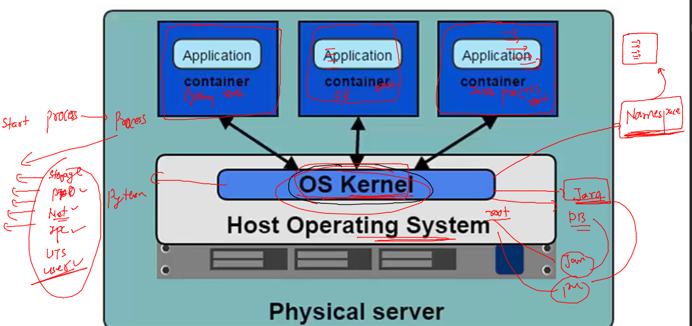
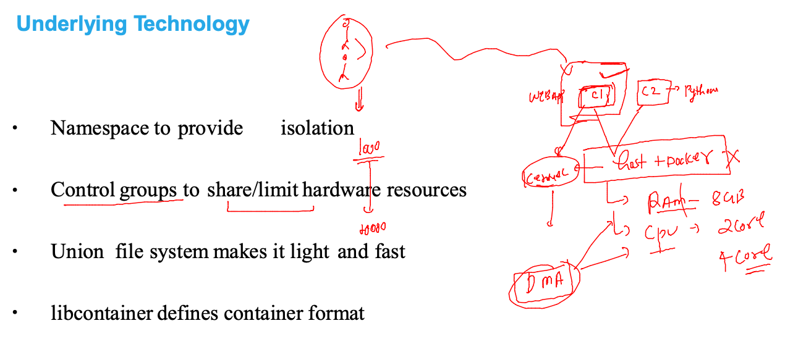
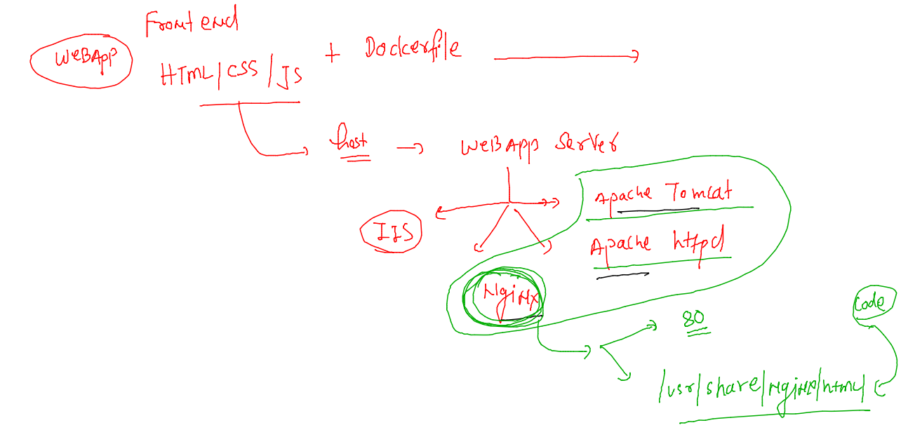
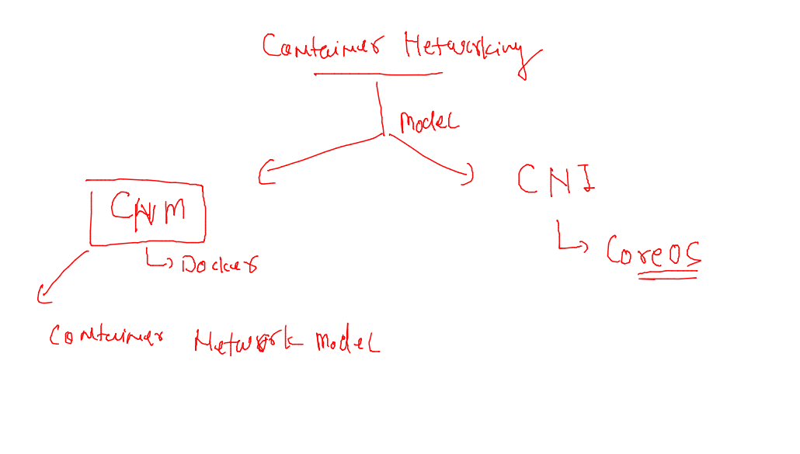
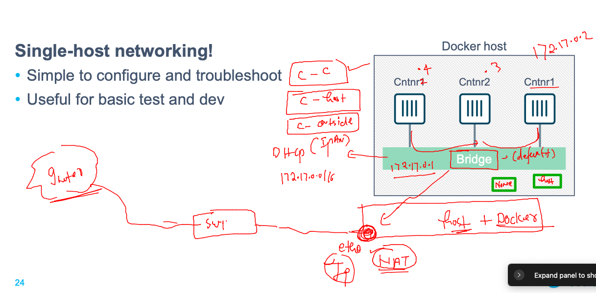
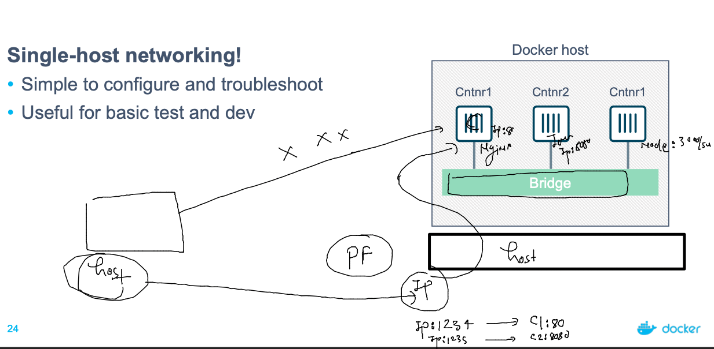

# dk-cisco-26sep2022

## Training Plan


## Namespaces in linux kernel for container isolation 



### checking kernel context of a container 

### creating container 

```
[ashu@ip-172-31-91-4 ashu-images]$ docker  run -d --name c1 alpine ping fb.com 
8bc8ed394457f56ed4948daecb521a5ee32d13c2551a96fedcb9e07c68f9ae9b
[ashu@ip-172-31-91-4 ashu-images]$ docker  ps
CONTAINER ID   IMAGE     COMMAND         CREATED         STATUS         PORTS     NAMES
8bc8ed394457   alpine    "ping fb.com"   3 seconds ago   Up 2 seconds             c1
[ashu@ip-172-31-91-4 ashu-images]$ docker  

```

### getting container pid 

```
 docker  inspect  c1  --format='{{.State.Pid}}'
 17892
```

### From linux host -- with root access 

```
[root@ip-172-31-91-4 ~]# ps  -e  |   grep -i 17892
17892 ?        00:00:00 ping
[root@ip-172-31-91-4 ~]# ps -aux  |   grep -i 17892
root     17892  0.6  0.0   1600   896 ?        Ss   04:50   0:00 ping fb.com
root     18043  0.0  0.0 119404   940 pts/11   S+   04:50   0:00 grep --color=auto -i 17892
[root@ip-172-31-91-4 ~]# 
[root@ip-172-31-91-4 ~]# cd  /proc/17892
[root@ip-172-31-91-4 17892]# ls
arch_status  cmdline          exe      limits     mounts      oom_score      root       smaps_rollup  task
attr         comm             fd       loginuid   mountstats  oom_score_adj  sched      stack         timens_offsets
autogroup    coredump_filter  fdinfo   map_files  net         pagemap        schedstat  stat          timers
auxv         cpuset           gid_map  maps       ns          patch_state    sessionid  statm         timerslack_ns
cgroup       cwd              io       mem        numa_maps   personality    setgroups  status        uid_map
clear_refs   environ          latency  mountinfo  oom_adj     projid_map     smaps      syscall       wchan
[root@ip-172-31-91-4 17892]# ls  ns/
cgroup  ipc  mnt  net  pid  pid_for_children  time  time_for_children  user  uts
[root@ip-172-31-91-4 17892]# 

```

### Cgroups in Containers 



## Dockerfile for frontend webapp 

### Understanding webapp servers 



### cloning git project 

```
git clone https://github.com/yenchiah/project-website-template.git
Cloning into 'project-website-template'...
remote: Enumerating objects: 1025, done.
remote: Total 1025 (delta 0), reused 0 (delta 0), pack-reused 1025
Receiving objects: 100% (1025/1025), 1.64 MiB | 14.59 MiB/s, done.
Resolving deltas: 100% (633/633), done.
[ashu@ip-172-31-91-4 webapps]$ ls
Dockerfile  project-website-template
[ashu@ip-172-31-91-4 webapps]$ 
```
### Dockerfile 

```
FROM nginx
LABEL name=ashutoshh
LABEL email=ashutoshh@Linux.com
ADD project-website-template  /usr/share/nginx/html/
# copy and add both can copy a directory also 
# if we don't write cmd/entrypoint then main image process will be 
# inherited  
```

### .dockerignore 

```
project-website-template/.git
project-website-template/.github
project-website-template/.gitignore
project-website-template/LICENSE
project-website-template/README.md

```

### lets build it 

```
[ashu@ip-172-31-91-4 webapps]$ ls -a
.  ..  Dockerfile  .dockerignore  project-website-template
[ashu@ip-172-31-91-4 webapps]$ 
[ashu@ip-172-31-91-4 webapps]$ docker build -t ashunginx:ciscov1 . 
Sending build context to Docker daemon   1.73MB
Step 1/4 : FROM nginx
 ---> 2d389e545974
Step 2/4 : LABEL name=ashutoshh
 ---> Running in 704a5a93e0d9
Removing intermediate container 704a5a93e0d9
 ---> daa934f7ce6a
Step 3/4 : LABEL email=ashutoshh@Linux.com
 ---> Running in 2728b7893382
Removing intermediate container 2728b7893382
 ---> 15a8616f2d68
Step 4/4 : ADD project-website-template  /usr/share/nginx/html/
 ---> f2863e6d3ed0
Successfully built f2863e6d3ed0
Successfully tagged ashunginx:ciscov1
```

### creating container 

```
ashu@ip-172-31-91-4 webapps]$ docker  run -d --name ashungc1  ashunginx:ciscov1  
89fca40be1e18c5e47028bb032c63ba333e9a50ef98a231006e9d737fac2f0d3
[ashu@ip-172-31-91-4 webapps]$ docker  ps
CONTAINER ID   IMAGE               COMMAND                  CREATED          STATUS          PORTS     NAMES
89fca40be1e1   ashunginx:ciscov1   "/docker-entrypoint.…"   4 seconds ago    Up 3 seconds    80/tcp    ashungc1
fe0d628e271f   9b35ca459926        "/docker-entrypoint.…"   38 seconds ago   Up 37 seconds   80/tcp    narasimhanginxcontainer
8bc8ed394457   alpine              "ping fb.com"            34 minutes ago   Up 30 minutes             c1
[ashu@ip-172-31-91-4 webapps]$ 
```

### adding cgroup layer in container 

```
docker  run -d --name ashungc1  --memory 100M --cpuset-cpus=0 --cpu-shares=256      ashunginx:ciscov1  
```
## Container networking 



### default bridge in docker CNM 



### bridge in more details 

```
[ashu@ip-172-31-91-4 ~]$ docker network  ls
NETWORK ID     NAME      DRIVER    SCOPE
b1821c82622a   bridge    bridge    local
82e9d6480631   host      host      local
9d2ab7b772c8   none      null      local
[ashu@ip-172-31-91-4 ~]$ 
[ashu@ip-172-31-91-4 ~]$ 
[ashu@ip-172-31-91-4 ~]$ docker network inspect  bridge 
[
    {
        "Name": "bridge",
        "Id": "b1821c82622a4e74a44261d088081f5c0ce74d6dd03659833317778fe749be62",
        "Created": "2022-09-27T03:52:15.615929308Z",
        "Scope": "local",
        "Driver": "bridge",
        "EnableIPv6": false,
        "IPAM": {
            "Driver": "default",
            "Options": null,
            "Config": [
                {
                    "Subnet": "172.17.0.0/16",
                    "Gateway": "172.17.0.1"
                }
            ]
        },
        "Internal": false,
        "Attachable": false,
        "Ingress": false,
        "ConfigFrom": {
            "Network": ""
        },
        "ConfigOnly": false,
        "Containers": {},

```

### checking container ip address

```
[ashu@ip-172-31-91-4 ~]$ docker  inspect  ashuc1  --format='{{.NetworkSettings.IPAddress}}'
172.17.0.2
[ashu@ip-172-31-91-4 ~]$ docker  inspect  ashuc1  --format='{{.NetworkSettings.MacAddress}}'
02:42:ac:11:00:02
[ashu@ip-172-31-91-4 ~]$ docker  inspect  ashuc1  --format='{{.NetworkSettings.MacAddress}} and IP address is  {{.NetworkSettings.IPAddress}}'
02:42:ac:11:00:02 and IP address is  172.17.0.2
[ashu@ip-172-31-91-4 ~]$ 

```

### Container - container  --- container to outside host / internet 

```
[ashu@ip-172-31-91-4 ~]$ docker  exec -it  ashuc1 sh 
/ # ifconfig 
eth0      Link encap:Ethernet  HWaddr 02:42:AC:11:00:02  
          inet addr:172.17.0.2  Bcast:172.17.255.255  Mask:255.255.0.0
          UP BROADCAST RUNNING MULTICAST  MTU:1500  Metric:1
          RX packets:13 errors:0 dropped:0 overruns:0 frame:0
          TX packets:0 errors:0 dropped:0 overruns:0 carrier:0
          collisions:0 txqueuelen:0 
          RX bytes:1070 (1.0 KiB)  TX bytes:0 (0.0 B)

lo        Link encap:Local Loopback  
          inet addr:127.0.0.1  Mask:255.0.0.0
          UP LOOPBACK RUNNING  MTU:65536  Metric:1
          RX packets:0 errors:0 dropped:0 overruns:0 frame:0
          TX packets:0 errors:0 dropped:0 overruns:0 carrier:0
          collisions:0 txqueuelen:1000 
          RX bytes:0 (0.0 B)  TX bytes:0 (0.0 B)

/ # ping  172.17.0.3
PING 172.17.0.3 (172.17.0.3): 56 data bytes
64 bytes from 172.17.0.3: seq=0 ttl=64 time=0.111 ms
64 bytes from 172.17.0.3: seq=1 ttl=64 time=0.077 ms
ç64 bytes from 172.17.0.3: seq=2 ttl=64 time=0.070 ms
64 bytes from 172.17.0.3: seq=3 ttl=64 time=0.068 ms
^C
--- 172.17.0.3 ping statistics ---
4 packets transmitted, 4 packets received, 0% packet loss
round-trip min/avg/max = 0.068/0.081/0.111 ms
/ # ping  google.com 
PING google.com (142.251.33.206): 56 data bytes
64 bytes from 142.251.33.206: seq=0 ttl=106 time=0.919 ms
64 bytes from 142.251.33.206: seq=1 ttl=106 time=0.906 ms
^C
--- google.com ping statistics ---
2 packets transmitted, 2 packets received, 0% packet loss
round-trip min/avg/max = 0.906/0.912/0.919 ms
/ # 

```

### port forwarding to expose container application 



### portforwarding 

```
[ashu@ip-172-31-91-4 webapps]$ docker run -d --name ashuwebc1 -p 1234:80 ashunginx:ciscov1  
a3f88298530b36a73d74a6c329ac7943a292aec20f122d5428d636e5f8762596
[ashu@ip-172-31-91-4 webapps]$ docker  ps
CONTAINER ID   IMAGE               COMMAND                  CREATED         STATUS         PORTS                                   NAMES
a3f88298530b   ashunginx:ciscov1   "/docker-entrypoint.…"   2 seconds ago   Up 2 seconds   0.0.0.0:1234->80/tcp, :::1234->80/tcp   ashuwebc1
[ashu@ip-172-31-91-4 webapps]$ 


```

### creating network bridge 

```
[ashu@ip-172-31-91-4 ~]$ docker network ls
NETWORK ID     NAME      DRIVER    SCOPE
b1821c82622a   bridge    bridge    local
82e9d6480631   host      host      local
9d2ab7b772c8   none      null      local
[ashu@ip-172-31-91-4 ~]$ 
[ashu@ip-172-31-91-4 ~]$ docker  network  create  ashubr1
523448662ff9880a55c413686d8fe2148c4b55cc3233da445240fb35d570da98
[ashu@ip-172-31-91-4 ~]$ docker network ls
NETWORK ID     NAME      DRIVER    SCOPE
523448662ff9   ashubr1   bridge    local
b1821c82622a   bridge    bridge    local
82e9d6480631   host      host      local
9d2ab7b772c8   none      null      local
[ashu@ip-172-31-91-4 ~]$ docker network inspect  ashubr1
[
    {
        "Name": "ashubr1",
        "Id": "523448662ff9880a55c413686d8fe2148c4b55cc3233da445240fb35d570da98",
        "Created": "2022-09-27T06:55:24.825375662Z",
        "Scope": "local",
        "Driver": "bridge",
        "EnableIPv6": false,
        "IPAM": {
            "Driver": "default",
            "Options": {},
            "Config": [
                {
                    "Subnet": "172.18.0.0/16",
                    "Gateway": "172.18.0.1"
                }

```

### contaienr in custom bridge 

```
[ashu@ip-172-31-91-4 ~]$ docker run -d --name ashuc1 --network  ashubr1  alpine ping fb.com 
1f718e391a552fc385b08b9d94d0cdc8b95c5f4944be2783a43474d2a36ec7cb
[ashu@ip-172-31-91-4 ~]$ docker run -d --name ashuc2 --network  ashubr1  alpine ping fb.com 
f4826b932a1bbd075bae803d8675a9843e4411b6d85c817d9ab368f80503420a
[ashu@ip-172-31-91-4 ~]$ 
[ashu@ip-172-31-91-4 ~]$ docker  exec -it ashuc1  sh 
/ # ping ashuc2
PING ashuc2 (172.18.0.3): 56 data bytes
64 bytes from 172.18.0.3: seq=0 ttl=64 time=0.104 ms
64 bytes from 172.18.0.3: seq=1 ttl=64 time=0.105 ms
^C
--- ashuc2 ping statistics ---
2 packets transmitted, 2 packets received, 0% packet loss
round-trip min/avg/max = 0.104/0.104/0.105 ms
/ # 

```

### custom bridge with custom subnet 

```
[ashu@ip-172-31-91-4 ~]$ docker  network  create  ashubr2  --subnet  192.168.100.0/24  --gateway 192.168.100.1 
3bf181f379bdef2d3029e230d55eb89d04dd5b40ecb05bd96ff1a272ab028a41
[ashu@ip-172-31-91-4 ~]$ 
[ashu@ip-172-31-91-4 ~]$ docker run -itd --name cc11 --network ashubr2  alpine 
8a4c5a2875be8ed835791e1b236378f9b8eb2883a8c170fded7f0dbd8c03e140
[ashu@ip-172-31-91-4 ~]$ docker run -itd --name cc222 --network ashubr2 --ip 192.168.100.200  alpine 
70e54287eb5e21cab0200c1a063efba281d1f050389b3b0f569f7f78c1ec002a

```

### None network for container with no networking 

```
[ashu@ip-172-31-91-4 ~]$ docker network ls
NETWORK ID     NAME         DRIVER    SCOPE
c11f24e289c6   ankurbrx1    bridge    local
556cb3ff2713   ankurbrx2    bridge    local
b1821c82622a   bridge       bridge    local
82e9d6480631   host         host      local
9d2ab7b772c8   none         null      local
c4c3e784efaa   suhas-brx1   bridge    local
8c401a38c874   suhas-brx2   bridge    local
[ashu@ip-172-31-91-4 ~]$ docker  run -it --rm  --network none alpine 
/ # 
/ # ifconfig 
lo        Link encap:Local Loopback  
          inet addr:127.0.0.1  Mask:255.0.0.0
          UP LOOPBACK RUNNING  MTU:65536  Metric:1
          RX packets:0 errors:0 dropped:0 overruns:0 frame:0
          TX packets:0 errors:0 dropped:0 overruns:0 carrier:0
          collisions:0 txqueuelen:1000 
          RX bytes:0 (0.0 B)  TX bytes:0 (0.0 B)

/ # exit

```

### container with host netowrking 

```
[ashu@ip-172-31-91-4 ~]$ docker run -it --rm --network host  alpine 
/ # ifconfig 
docker0   Link encap:Ethernet  HWaddr 02:42:A7:65:8C:53  
          inet addr:172.17.0.1  Bcast:172.17.255.255  Mask:255.255.0.0
          inet6 addr: fe80::42:a7ff:fe65:8c53/64 Scope:Link
          UP BROADCAST MULTICAST  MTU:1500  Metric:1
          RX packets:11998 errors:0 dropped:0 overruns:0 frame:0
          TX packets:11253 errors:0 dropped:0 overruns:0 carrier:0
          collisions:0 txqueuelen:0 
          RX bytes:22822235 (21.7 MiB)  TX bytes:980401 (957.4 KiB)

eth0      Link encap:Ethernet  HWaddr 12:E8:68:B5:5E:E9  
          inet addr:172.31.91.4  Bcast:172.31.95.255  Mask:255.255.240.0
          inet6 addr: fe80::10e8:68ff:feb5:5ee9/64 Scope:Link
          UP BROADCAST RUNNING MULTICAST  MTU:9001  Metric:1
          RX packets:423100 errors:0 dropped:0 overruns:0 frame:0
          TX packets:320924 errors:0 dropped:0 overruns:0 carrier:0
          collisions:0 txqueuelen:1000 
          RX bytes:167690288 (159.9 MiB)  TX bytes:85162244 (81.2 MiB)


```


