# dk-cisco-26sep2022

## Training Plan

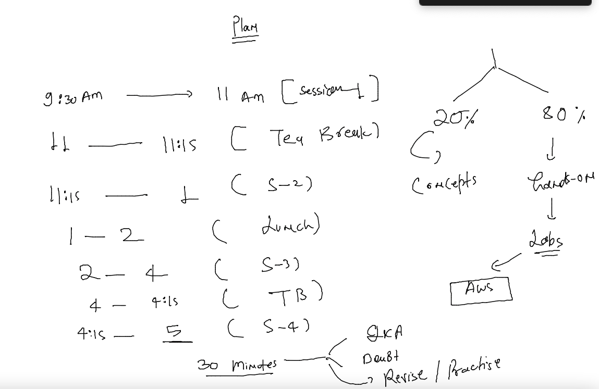

### bare-metal systems if there is incompatiblity in apps 

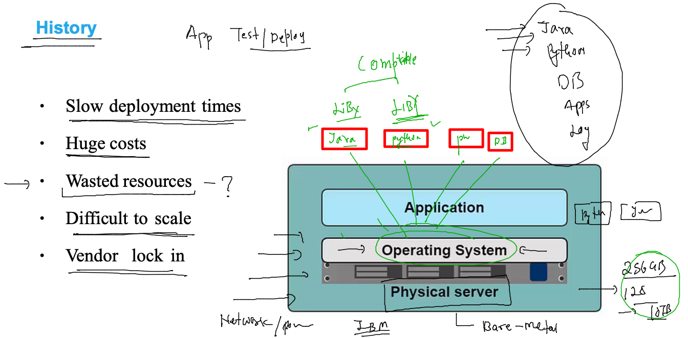

### Solution by Hypervisor -- Virtualization 

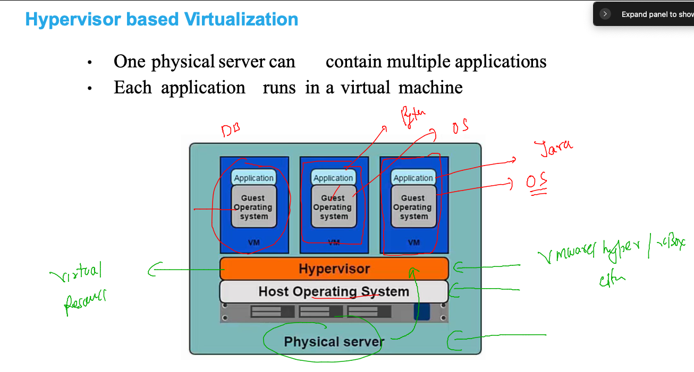

### problems with Vm 

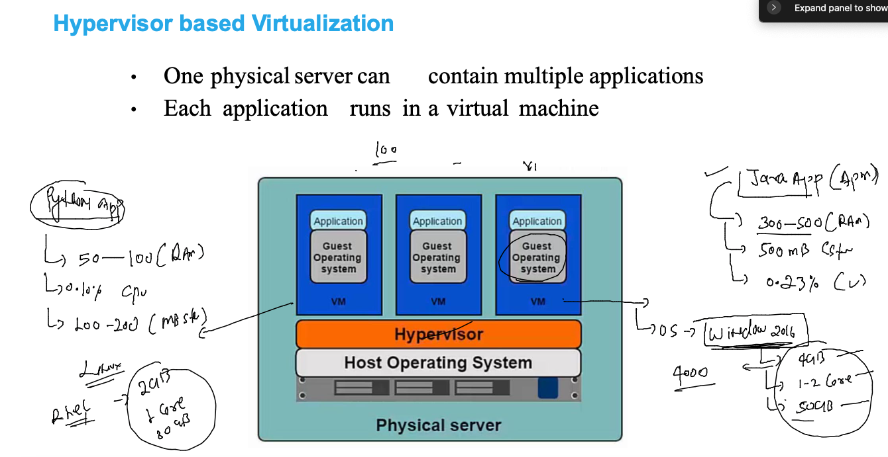

### Understanding components of OS 

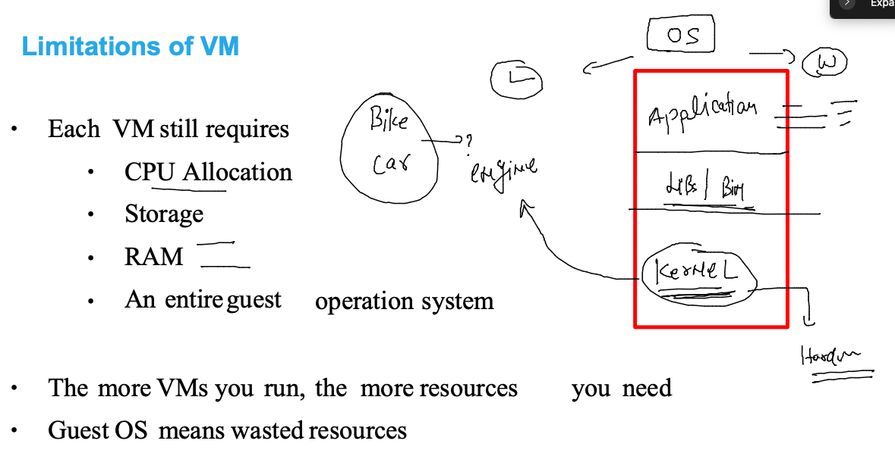

### Introduction to containers 

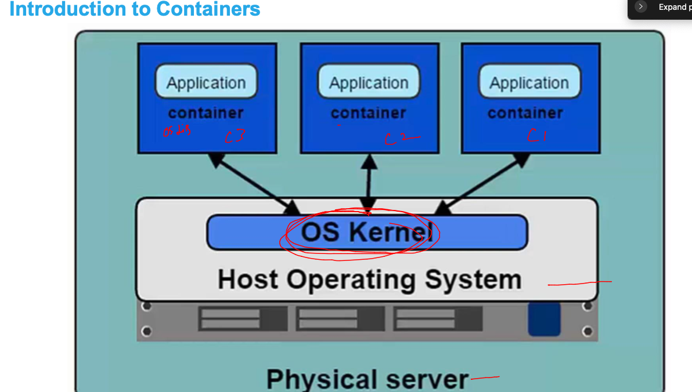

### vm vs containers 

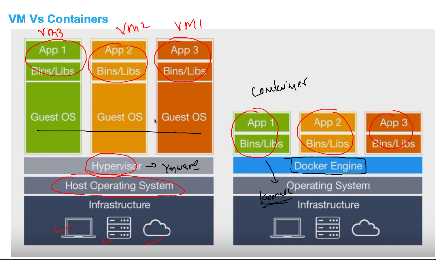

### FInal journey to the containers 

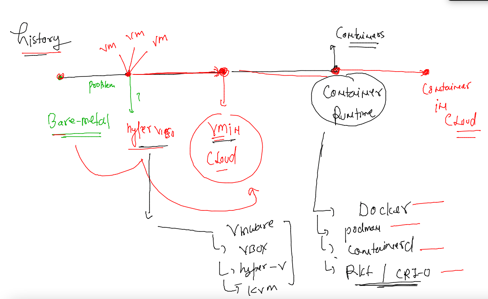

### Docker installation link

[click_here](https://docs.docker.com/engine/install/)

### installing docker on amazon linux 

```
[root@ip-172-31-91-4 ~]# yum  install docker -y 
Failed to set locale, defaulting to C
Loaded plugins: extras_suggestions, langpacks, priorities, update-motd
amzn2-core                                                                                                          | 3.7 kB  00:00:00     
Package docker-20.10.17-1.amzn2.x86_64 already installed and latest version
Nothing to do
[root@ip-172-31-91-4 ~]# 
[root@ip-172-31-91-4 ~]# systemctl start docker 
[root@ip-172-31-91-4 ~]# systemctl status  docker 
● docker.service - Docker Application Container Engine
   Loaded: loaded (/usr/lib/systemd/system/docker.service; enabled; vendor preset: disabled)
   Active: active (running) since Mon 2022-09-26 03:59:29 UTC; 1h 13min ago
     Docs: https://docs.docker.com
  Process: 3221 ExecStartPre=/usr/libexec/docker/docker-setup-runtimes.sh (code=exited, status=0/SUCCESS)
  Process: 3216 ExecStartPre=/bin/mkdir -p /run/docker (code=exited, status=0/SUCCESS)
 Main PID: 3231 (dockerd)
    Tasks: 8

```

### accessing and check docker installation 

```
root@ip-172-31-91-4 ~]# docker  version 
Client:
 Version:           20.10.17
 API version:       1.41
 Go version:        go1.18.3
 Git commit:        100c701
 Built:             Thu Jun 16 20:08:47 2022
 OS/Arch:           linux/amd64
 Context:           default
 Experimental:      true

Server:
 Engine:
  Version:          20.10.17
  API version:      1.41 (minimum version 1.12)
  Go version:       go1.18.3
  Git commit:       a89b842
  Built:            Thu Jun 16 20:09:24 2022
  OS/Arch:          linux/amd64
  Experimental:     false
 containerd:
  Version:          1.6.6
  GitCommit:        10c12954828e7c7c9b6e0ea9b0c02b01407d3ae1
 runc:
  Version:          1.1.3
  GitCommit:        1e7bb5b773162b57333d57f612fd72e3f8612d94
 docker-init:
  Version:          0.19.0
  GitCommit:        de40ad0

```

### to creating containers will need container app images 

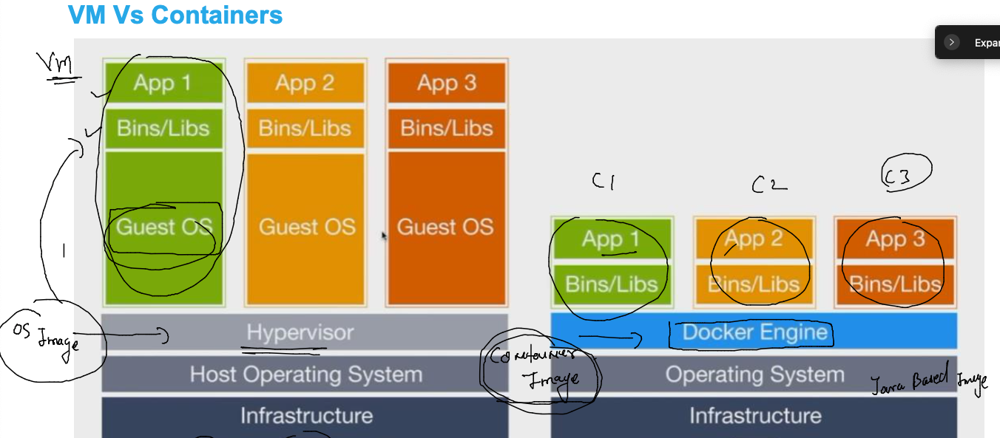

### container images from container registries 

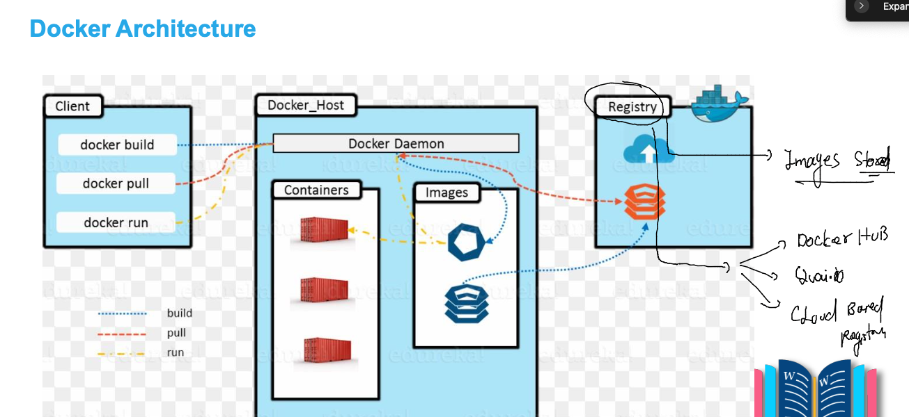

###  images & containers 

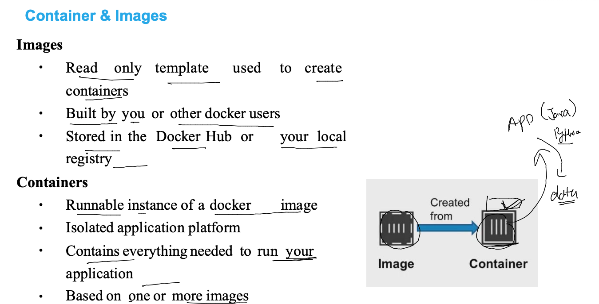


### checking and pull images in docker host 

```
[root@ip-172-31-91-4 ~]# docker  images
REPOSITORY    TAG       IMAGE ID       CREATED         SIZE
hello-world   latest    feb5d9fea6a5   12 months ago   13.3kB
[root@ip-172-31-91-4 ~]# 
[root@ip-172-31-91-4 ~]# docker  pull  python 
Using default tag: latest
latest: Pulling from library/python
23858da423a6: Pull complete 
326f452ade5c: Pull complete 
a42821cd14fb: Pull complete 
8471b75885ef: Pull complete 
8ffa7aaef404: Pull complete 
15132af73342: Pull complete 
aaf3b07565c2: Pull complete 
736f7bc16867: Pull complete 
94da21e53a5b: Pull complete 
Digest: sha256:e9c35537103a2801a30b15a77d4a56b35532c964489b125ec1ff24f3d5b53409
Status: Downloaded newer image for python:latest
docker.io/library/python:latest
[root@ip-172-31-91-4 ~]# docker images
REPOSITORY    TAG       IMAGE ID       CREATED         SIZE
python        latest    e285995a3494   12 days ago     921MB
hello-world   latest    feb5d9fea6a5   12 months ago   13.3kB
```

###

```
[root@ip-172-31-91-4 ~]# docker pull openjdk 
Using default tag: latest
latest: Pulling from library/openjdk
051f419db9dd: Pull complete 
aa51c6010a14: Pull complete 
eb80f8e66e0b: Pull complete 
Digest: sha256:14a8f0b5f29cf814e635c03a20be91bc498b8f52e7ea59ee1fa59189439e8c26
Status: Downloaded newer image for openjdk:latest
docker.io/library/openjdk:latest
[root@ip-172-31-91-4 ~]# docker pull redhat/ubi8
Using default tag: latest
latest: Pulling from redhat/ubi8
1b3417e31a5e: Pull complete 
809fe483e885: Pull complete 
Digest: sha256:8ce9caf9d86c83b47bda7c73a8fafb5fcf17f56ea13c050408cfb59aae28ae98
Status: Downloaded newer image for redhat/ubi8:latest
docker.io/redhat/ubi8:latest
[root@ip-172-31-91-4 ~]# docker images
REPOSITORY    TAG       IMAGE ID       CREATED         SIZE
openjdk       latest    116c4fdea277   11 days ago     464MB
python        latest    e285995a3494   12 days ago     921MB
node          latest    2577ab2cda97   12 days ago     991MB
redhat/ubi8   latest    10f854072e7e   2 weeks ago     209MB
hello-world   latest    feb5d9fea6a5   12 months ago   13.3kB
```

### container with single process 

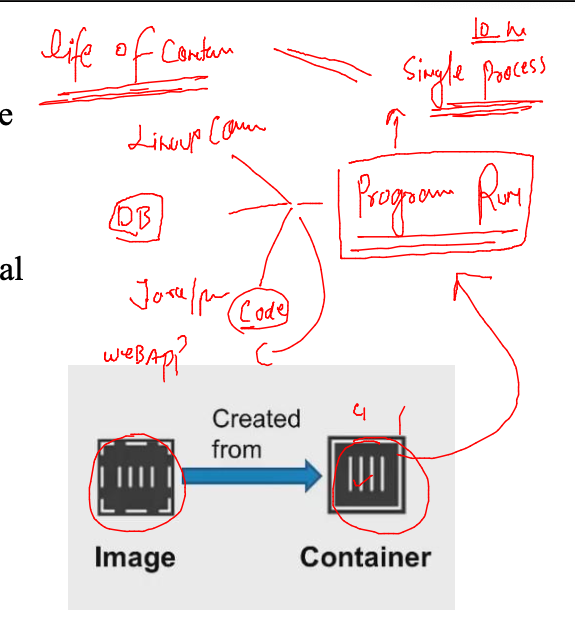

## creating container 


### 

```
[ashu@ip-172-31-91-4 ~]$ docker  run  --name  ashuc1 -it -d  alpine:latest ping  google.com 
1f65441968408d909e4c0e40fda5195eb03753f441d3ab1cd33e461dd2cbfc01
[ashu@ip-172-31-91-4 ~]$ docker  ps
CONTAINER ID   IMAGE           COMMAND             CREATED          STATUS          PORTS     NAMES
b58a23c12d6f   alpine:latest   "ping google.com"   3 seconds ago    Up 1 second               sridhar1
1f6544196840   alpine:latest   "ping google.com"   6 seconds ago    Up 4 seconds              ashuc1
4a8bd89328fc   alpine:latest   "ping google.com"   54 seconds ago   Up 53 seconds             suhas
[ashu@ip-172-31-91-4 ~]$ 

```

### container resource consumption 

```
[ashu@ip-172-31-91-4 ~]$ docker  stats  ashuc1 


CONTAINER ID   NAME      CPU %     MEM USAGE / LIMIT   MEM %     NET I/O           BLOCK I/O   PIDS
1f6544196840   ashuc1    0.02%     352KiB / 7.761GiB   0.00%     65.8kB / 64.2kB   0B / 0B     1
^C

```

### show container process output 

```
docker logs ashuc1 

```
### docker storage inside host 

```
[root@ip-172-31-91-4 ~]# cd  /var/lib/docker/
[root@ip-172-31-91-4 docker]# ls
buildkit  containers  image  network  overlay2  plugins  runtimes  swarm  tmp  trust  volumes
[root@ip-172-31-91-4 docker]# 

```

### some details about docker daemon 

```
 44  cd /etc/sysconfig/
   45  ls
   46  cat  docker
   47  systemctl status docker 
   48  journalctl -u docker 
   49  history 
[root@ip-172-31-91-4 sysconfig]# systemctl start docker 
[root@ip-172-31-91-4 sysconfig]# systemctl status  docker 
● docker.service - Docker Application Container Engine
   Loaded: loaded (/usr/lib/systemd/system/docker.service; enabled; vendor preset: disabled)
   Active: active (running) since Mon 2022-09-26 06:32:05 UTC; 5s ago
     Docs: https://docs.docker.com
  Process: 2613 ExecStartPre=/usr/libexec/docker/docker-setup-runtimes.sh (code=exited, status=0/SUCCESS)
  Process: 2610 ExecStartPre=/bin/mkdir -p /run/docker (code=exited, status=0/SUCCESS)
 Main PID: 2616 (dockerd)
    Tasks: 19
   Memory: 24.1M

```

### restart docker daemon is gonna stop docker containers

```
ashu@ip-172-31-91-4 ~]$ docker  ps -a
CONTAINER ID   IMAGE           COMMAND               CREATED             STATUS                         PORTS     NAMES
1de448d0ede9   alpine:latest   "ping google.com"     16 minutes ago      Exited (137) 3 minutes ago               pasha1
a8bdb738d96d   alpine:latest   "ping google.com"     18 minutes ago      Exited (0) 18 minutes ago                ashuc2
c1bb9c1fc6f3   alpine:latest   "ping google.com"     19 minutes ago      Exited (137) 3 minutes ago               yashc1
20d1e5fee0e9   alpine          "ping google.com"     22 minutes ago      Exited (137) 3 minutes ago               narc2
8bbadccfeab4   alpine:latest   "ping google.co.in"   23 minutes ago      Exited (137) 3 minutes ago               balaji
026211be8b6d   alpine:latest   "ping google.com"     23 minutes ago      Exited (137) 3 minutes ago               ankurc1
a74a382c9d81   alpine:latest   "ping google.com"     23 minutes ago      Exited (137) 3 minutes ago               pramod1
bbfd6b72ffdf   alpine          "pwd"                 23 minutes ago      Exited (0) 23 minutes ago                narc1
b0e199cbb4e8   alpine:latest   "ping google.com"     23 minutes ago      Exited (137) 3 minutes ago               priyanka
b58a23c12d6f   alpine:latest   "ping google.com"     24 minutes ago      Exited (137) 3 minutes ago               sridhar1
```

### starting a stopped container 

```
[ashu@ip-172-31-91-4 ~]$ docker  start  ashuc1
ashuc1
[ashu@ip-172-31-91-4 ~]$ docker  ps
CONTAINER ID   IMAGE           COMMAND             CREATED              STATUS              PORTS     NAMES
b29c17f6e5f3   alpine          "ping fb.com"       About a minute ago   Up About a minute             ashuc4
1f6544196840   alpine:latest   "ping google.com"   27 minutes ago       Up 2 seconds                  ashuc1
[ashu@ip-172-31-91-4 ~]$ 

```

### stop a running container 

```
[ashu@ip-172-31-91-4 ~]$ docker  stop   ashuc1
ashuc1

```

### access container shell 

```
[ashu@ip-172-31-91-4 ~]$ docker  exec  -it   ashuc1   sh 
/ # 
/ # cat  /etc/os-release 
NAME="Alpine Linux"
ID=alpine
VERSION_ID=3.16.2
PRETTY_NAME="Alpine Linux v3.16"
HOME_URL="https://alpinelinux.org/"
BUG_REPORT_URL="https://gitlab.alpinelinux.org/alpine/aports/-/issues"
/ # ls
bin    dev    etc    home   lib    media  mnt    opt    proc   root   run    sbin   srv    sys    tmp    usr    var
/ # ifconfig 
eth0      Link encap:Ethernet  HWaddr 02:42:AC:11:00:03  
          inet addr:172.17.0.3  Bcast:172.17.255.255  Mask:255.255.0.0
          UP BROADCAST RUNNING MULTICAST  MTU:1500  Metric:1
          RX packets:263 errors:0 dropped:0 overruns:0 frame:0
          TX packets:251 errors:0 dropped:0 overruns:0 carrier:0
          collisions:0 txqueuelen:0 
          RX bytes:24970 (24.3 KiB)  TX bytes:23870 (23.3 KiB)

lo        Link encap:Local Loopback  
          inet addr:127.0.0.1  Mask:255.0.0.0
          UP LOOPBACK RUNNING  MTU:65536  Metric:1
          RX packets:0 errors:0 dropped:0 overruns:0 frame:0
          TX packets:0 errors:0 dropped:0 overruns:0 carrier:0
          collisions:0 txqueuelen:1000 
          RX bytes:0 (0.0 B)  TX bytes:0 (0.0 B)

/ # whoami
root
/ # exit

```

### removing a contaienr 

```
[ashu@ip-172-31-91-4 ~]$ docker  stop  ashuc1
ashuc1
[ashu@ip-172-31-91-4 ~]$ docker  rm ashuc1
ashuc1

```

### removing image 

```
ashu@ip-172-31-91-4 ~]$ docker rmi python:latest  
Untagged: python:latest
Untagged: python@sha256:e9c35537103a2801a30b15a77d4a56b35532c964489b125ec1ff24f3d5b53409
Deleted: sha256:e285995a34947a2d58defdbdd65eb7478a4986292ff13127678c1f5ace92c9a2
Deleted: sha256:27d6b0809ed1700079fcf34f5be67319503291c466d9fd2015dcbd5eeac4bae2
Deleted: sha256:bb048bc446f872e6cd9b314700df0d8bed28a9a47587e008bf16a7f88b4e6571
Deleted: sha256:10034da3f5f17bb210a4f3441df7e27dd14f7f33d1e85828db614a8dd68ccc9d
Deleted: sha256:db12f3053429d559642a9c0cc2deb4024a59efa58df22f54f029d6b9d6a248ff
```

### building container images 

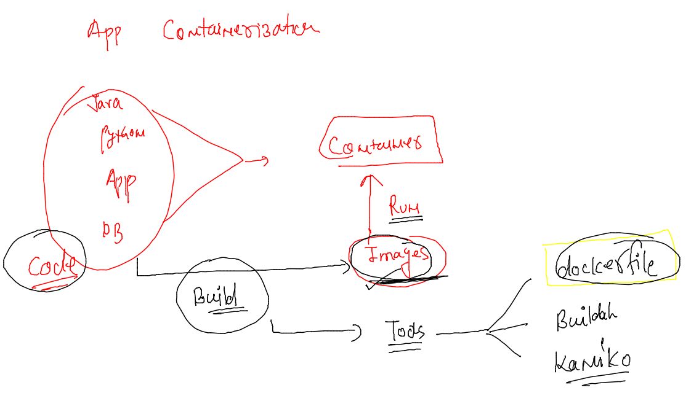

