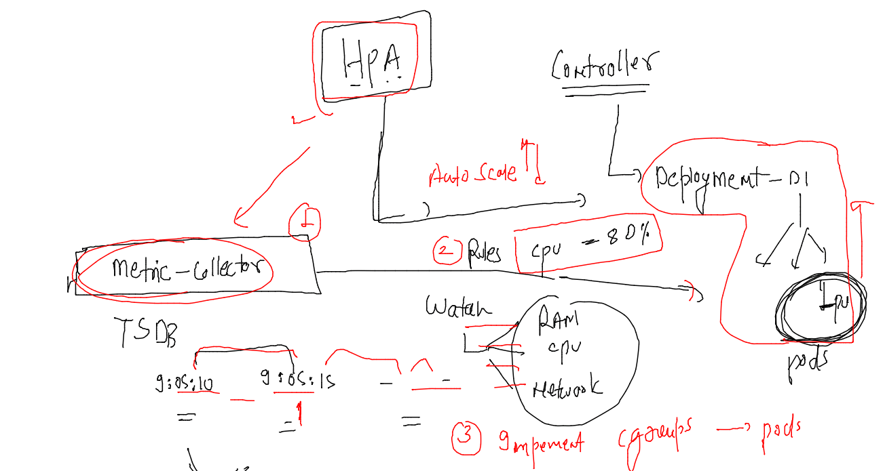

# dk-cisco-26sep2022

## Training Plan


### Deploying k8s dashboard 

```
[ashu@ip-172-31-91-4 ~]$ kubectl apply -f https://raw.githubusercontent.com/kubernetes/dashboard/v2.7.0/aio/deploy/recommended.yaml
namespace/kubernetes-dashboard created
serviceaccount/kubernetes-dashboard created
service/kubernetes-dashboard created
secret/kubernetes-dashboard-certs created
secret/kubernetes-dashboard-csrf created
secret/kubernetes-dashboard-key-holder created
configmap/kubernetes-dashboard-settings created
role.rbac.authorization.k8s.io/kubernetes-dashboard created
clusterrole.rbac.authorization.k8s.io/kubernetes-dashboard created
rolebinding.rbac.authorization.k8s.io/kubernetes-dashboard created
clusterrolebinding.rbac.authorization.k8s.io/kubernetes-dashboard created
deployment.apps/kubernetes-dashboard created
service/dashboard-metrics-scraper created
deployment.apps/dashboard-metrics-scraper created
[ashu@ip-172-31-91-4 ~]$ 

```

### verifying deployments 

```
[ashu@ip-172-31-91-4 ~]$ kubectl  get  deploy -n kubernetes-dashboard
NAME                        READY   UP-TO-DATE   AVAILABLE   AGE
dashboard-metrics-scraper   1/1     1            1           3m55s
kubernetes-dashboard        1/1     1            1           3m55s
[ashu@ip-172-31-91-4 ~]$ 
[ashu@ip-172-31-91-4 ~]$ 
[ashu@ip-172-31-91-4 ~]$ kubectl  get  po  -n kubernetes-dashboard
NAME                                         READY   STATUS    RESTARTS   AGE
dashboard-metrics-scraper-64bcc67c9c-wqgln   1/1     Running   0          4m7s
kubernetes-dashboard-5c8bd6b59-78j8f         1/1     Running   0          4m7s
[ashu@ip-172-31-91-4 ~]$ 
[ashu@ip-172-31-91-4 ~]$ kubectl  get  svc  -n kubernetes-dashboard
NAME                        TYPE        CLUSTER-IP       EXTERNAL-IP   PORT(S)    AGE
dashboard-metrics-scraper   ClusterIP   10.110.138.160   <none>        8000/TCP   4m14s
kubernetes-dashboard        ClusterIP   10.100.111.231   <none>        443/TCP    4m14s
[ashu@ip-172-31-91-4 ~]$ 


```

### changing svc type to Nodeport 

```
[ashu@ip-172-31-91-4 ~]$ kubectl  edit   svc  kubernetes-dashboard   -n kubernetes-dashboard
service/kubernetes-dashboard edited
[ashu@ip-172-31-91-4 ~]$ kubectl  get  svc  -n kubernetes-dashboard
NAME                        TYPE        CLUSTER-IP       EXTERNAL-IP   PORT(S)         AGE
dashboard-metrics-scraper   ClusterIP   10.110.138.160   <none>        8000/TCP        6m14s
kubernetes-dashboard        NodePort    10.100.111.231   <none>        443:30657/TCP   6m14s
[ashu@ip-172-31-91-4 ~]$ 
```

### dashboard token from k8s 1.24 onwards we have to create 

```
apiVersion: v1
kind: Secret
type: kubernetes.io/service-account-token
metadata:
  name: cicd
  namespace: kubernetes-dashboard
  annotations:
    kubernetes.io/service-account.name: "kubernetes-dashboard"
```
### 

```
[ashu@ip-172-31-91-4 ashu-images]$ kubectl apply -f k8s-app-deploy/token.yaml 
secret/cicd created
[ashu@ip-172-31-91-4 ashu-images]$ kubectl  get  secret -n kubernetes-dashboard 
NAME                              TYPE                                  DATA   AGE
cicd                              kubernetes.io/service-account-token   3      7s
kubernetes-dashboard-certs        Opaque                                0      12m
kubernetes-dashboard-csrf         Opaque                                1      12m
kubernetes-dashboard-key-holder   Opaque                                2      12m
[ashu@ip-172-31-91-4 ashu-images]$ 


```

### getting token 

```
[ashu@ip-172-31-91-4 ~]$ kubectl  get  secret  -n kubernetes-dashboard 
NAME                              TYPE                                  DATA   AGE
cicd                              kubernetes.io/service-account-token   3      81s
kubernetes-dashboard-certs        Opaque                                0      13m
kubernetes-dashboard-csrf         Opaque                                1      13m
kubernetes-dashboard-key-holder   Opaque                                2      13m
[ashu@ip-172-31-91-4 ~]$ 
[ashu@ip-172-31-91-4 ~]$ kubectl  describe secrets  cicd  -n kubernetes-dashboard 
Name:         cicd
Namespace:    kubernetes-dashboard
Labels:       <none>
Annotations:  kubernetes.io/service-account.name: kubernetes-dashboard
              kubernetes.io/service-account.uid: 6d751dc0-5075-46bd-ba23-c82c11ef0120

Type:  kubernetes.io/service-account-token

Data
====
ca.crt:     1099 bytes
namespace:  20 bytes
token:      eyJhbGciOiJSUzI1NiIsImtpZCI6InFMNlN0VzFVSzhRbGlTd3htcjViaDJscU84dnR5RlJwSm5nRXdwa2ktUDAifQ.eyJpc3MiOiJrdWJlcm5ldGVzL3NlcnZpY2VhY2NvdW50Iiwia3ViZXJuZXRlcy
```

### give permission to k8s dashboard 

```
kubectl  create  clusterrolebinding  b1 --clusterrole  cluster-admin --serviceaccount=kubernetes-dashboard:kubernetes-dashboard
```

## On-primse k8s --troubleshooting & Observation 

## master / control plane -- node 

### 

```
[root@control-plane ~]# cd  /etc/kubernetes/
[root@control-plane kubernetes]# ls
admin.conf  controller-manager.conf  kubelet.conf  manifests  pki  scheduler.conf
[root@control-plane kubernetes]# cd pki/
[root@control-plane pki]# ls
apiserver-etcd-client.crt     apiserver-kubelet-client.key  ca.crt  front-proxy-ca.crt      front-proxy-client.key
apiserver-etcd-client.key     apiserver.crt                 ca.key  front-proxy-ca.key      sa.key
apiserver-kubelet-client.crt  apiserver.key                 etcd    front-proxy-client.crt  sa.pub
[root@control-plane pki]# ls etcd/
ca.crt  ca.key  healthcheck-client.crt  healthcheck-client.key  peer.crt  peer.key  server.crt  server.key
[root@control-plane pki]# 
[root@control-plane pki]# 
[root@control-plane pki]# cd ..
[root@control-plane kubernetes]# ls
admin.conf  controller-manager.conf  kubelet.conf  manifests  pki  scheduler.conf
[root@control-plane kubernetes]# cd  manifests/
[root@control-plane manifests]# ls
etcd.yaml  kube-apiserver.yaml  kube-controller-manager.yaml  kube-scheduler.yaml
[root@control-plane manifests]# vim  kube-apiserver.yaml 
[root@control-plane manifests]# 

```

### k8s master node datastorage

```
[root@control-plane manifests]# cd  /var/lib/
[root@control-plane lib]# ls
alternatives  chrony      dav       etcd           httpd      machines  os-prober  rpm        systemd
amazon        cloud       dbus      games          initramfs  misc      plymouth   rpm-state  update-motd
authconfig    cni         dhclient  gssproxy       kubelet    mlocate   postfix    rsyslog    xfsdump
calico        containerd  docker    hibinit-agent  logrotate  nfs       rpcbind    stateless  yum
[root@control-plane lib]# 
[root@control-plane lib]# cd  kubelet/
[root@control-plane kubelet]# ls
config.yaml        device-plugins     memory_manager_state  plugins           pod-resources
cpu_manager_state  kubeadm-flags.env  pki                   plugins_registry  pods
[root@control-plane kubelet]# cd  pods/
[root@control-plane pods]# ls
0e2f4065f73b9283efca87146ca2d3
```

## HPA in k8s 



### Implementing metric server in k8s 

```
ashu@ip-172-31-91-4 ~]$ kubectl apply -f https://raw.githubusercontent.com/redashu/k8s/hpa/hpa/components.yaml
serviceaccount/metrics-server created
clusterrole.rbac.authorization.k8s.io/system:aggregated-metrics-reader created
clusterrole.rbac.authorization.k8s.io/system:metrics-server created
rolebinding.rbac.authorization.k8s.io/metrics-server-auth-reader created
clusterrolebinding.rbac.authorization.k8s.io/metrics-server:system:auth-delegator created
clusterrolebinding.rbac.authorization.k8s.io/system:metrics-server created
service/metrics-server created
deployment.apps/metrics-server created
apiservice.apiregistration.k8s.io/v1beta1.metrics.k8s.io created
[ashu@ip-172-31-91-4 ~]$ 
[ashu@ip-172-31-91-4 ~]$ 
[ashu@ip-172-31-91-4 ~]$ kubectl  get  po -n kube-system 
NAME                                       READY   STATUS    RESTARTS       AGE
calico-kube-controllers-58dbc876ff-ls87g   1/1     Running   2 (161m ago)   46h
calico-node-q4d48                          1/1     Running   2 (161m ago)   46h
calico-node-qkh96                          1/1     Running   2 (161m ago)   46h
calico-node-wm7m5                          1/1     Running   2 (161m ago)   46h
calico-node-zkpn2                          1/1     Running   2 (161m ago)   46h
coredns-565d847f94-8t8zw                   1/1     Running   2 (161m ago)   46h
coredns-565d847f94-m2swp                   1/1     Running   2 (161m ago)   46h
etcd-control-plane                         1/1     Running   2 (161m ago)   46h
kube-apiserver-control-plane               1/1     Running   2 (161m ago)   46h
kube-controller-manager-control-plane      1/1     Running   2 (161m ago)   46h
kube-proxy-ltxf4                           1/1     Running   2 (161m ago)   46h
kube-proxy-ntxkw                           1/1     Running   2 (161m ago)   46h
kube-proxy-nxswg                           1/1     Running   2 (161m ago)   46h
kube-proxy-zqnd6                           1/1     Running   2 (161m ago)   46h
kube-scheduler-control-plane               1/1     Running   2 (161m ago)   46h
metrics-server-767967fcd-nt2gw             1/1     Running   0              8s
[ashu@ip-172-31-91-4 ~]$ 

```

### Demo 

### creating deployment YAML 

```
kubectl create  deployment ashu-hpa-deploy --image=docker.io/dockerashu/ciscoapp:v1  --port 80 --dry-run=client -o yaml  >hpa_demo.yaml 
```

### updated YAML with Resources 

```
apiVersion: apps/v1
kind: Deployment
metadata:
  creationTimestamp: null
  labels:
    app: ashu-hpa-deploy
  name: ashu-hpa-deploy # name of Deployment 
  namespace: ashu-apps # namespace info 
spec:
  replicas: 1
  selector:
    matchLabels:
      app: ashu-hpa-deploy
  strategy: {}
  template: # for pod creation purpose 
    metadata:
      creationTimestamp: null
      labels:
        app: ashu-hpa-deploy
    spec:
      containers:
      - image: docker.io/dockerashu/ciscoapp:v1
        name: ciscoapp
        ports:
        - containerPort: 80
        resources: # cgroups implementation 
          requests: # default resources by pod container 
            memory: 200M 
            cpu: 100m # 1vcpu -- 1000m --m milicore 
          limits:  # max it can use 
            memory: 400M 
            cpu: 200m 
status: {}

```

### Deploy it 

```
[ashu@ip-172-31-91-4 k8s-app-deploy]$ kubectl apply -f hpa_demo.yaml 
deployment.apps/ashu-hpa-deploy created
[ashu@ip-172-31-91-4 k8s-app-deploy]$ kubectl  get  deploy
NAME              READY   UP-TO-DATE   AVAILABLE   AGE
ashu-hpa-deploy   1/1     1            1           7s
[ashu@ip-172-31-91-4 k8s-app-deploy]$ kubectl  get  po
NAME                               READY   STATUS    RESTARTS   AGE
ashu-hpa-deploy-5cd97b5cc7-7p4tg   1/1     Running   0          11s
[ashu@ip-172-31-91-4 k8s-app-deploy]$ 

```

### adding service in same YAML 

```
apiVersion: apps/v1
kind: Deployment
metadata:
  creationTimestamp: null
  labels:
    app: ashu-hpa-deploy
  name: ashu-hpa-deploy # name of Deployment 
  namespace: ashu-apps # namespace info 
spec:
  replicas: 1
  selector:
    matchLabels:
      app: ashu-hpa-deploy
  strategy: {}
  template: # for pod creation purpose 
    metadata:
      creationTimestamp: null
      labels:
        app: ashu-hpa-deploy
    spec:
      containers:
      - image: docker.io/dockerashu/ciscoapp:v1
        name: ciscoapp
        ports:
        - containerPort: 80
        resources: # cgroups implementation 
          requests: # default resources by pod container 
            memory: 200M 
            cpu: 100m # 1vcpu -- 1000m --m milicore 
          limits:  # max it can use 
            memory: 400M 
            cpu: 200m 
status: {}
---
apiVersion: v1
kind: Service
metadata:
  creationTimestamp: null
  labels:
    app: ashu-hpa-deploy
  name: ashulb01
spec:
  ports:
  - port: 80
    protocol: TCP
    targetPort: 80
  selector:
    app: ashu-hpa-deploy
  type: NodePort
status:
  loadBalancer: {}
```


### lets deploy it 

```
[ashu@ip-172-31-91-4 k8s-app-deploy]$ kubectl  apply -f hpa_demo.yaml 
deployment.apps/ashu-hpa-deploy configured
service/ashulb01 created
[ashu@ip-172-31-91-4 k8s-app-deploy]$ kubectl  get  svc
NAME       TYPE       CLUSTER-IP    EXTERNAL-IP   PORT(S)        AGE
ashulb01   NodePort   10.96.98.48   <none>        80:30734/TCP   10s
[ashu@ip-172-31-91-4 k8s-app-deploy]$ 


```

### writing HPA rule 

```
 kubectl  autoscale   deployment  ashu-hpa-deploy  --cpu-percent 70 --max=20 --min=3  --dry-run=client -o yaml
```

### final YAML 

```
apiVersion: apps/v1
kind: Deployment
metadata:
  creationTimestamp: null
  labels:
    app: ashu-hpa-deploy
  name: ashu-hpa-deploy # name of Deployment 
  namespace: ashu-apps # namespace info 
spec:
  replicas: 1
  selector:
    matchLabels:
      app: ashu-hpa-deploy
  strategy: {}
  template: # for pod creation purpose 
    metadata:
      creationTimestamp: null
      labels:
        app: ashu-hpa-deploy
    spec:
      containers:
      - image: docker.io/dockerashu/ciscoapp:v1
        name: ciscoapp
        ports:
        - containerPort: 80
        resources: # cgroups implementation 
          requests: # default resources by pod container 
            memory: 200M 
            cpu: 100m # 1vcpu -- 1000m --m milicore 
          limits:  # max it can use 
            memory: 400M 
            cpu: 200m 
status: {}
---
apiVersion: v1
kind: Service
metadata:
  creationTimestamp: null
  labels:
    app: ashu-hpa-deploy
  name: ashulb01
spec:
  ports:
  - port: 80
    protocol: TCP
    targetPort: 80
  selector:
    app: ashu-hpa-deploy
  type: NodePort
status:
  loadBalancer: {}
  
---
apiVersion: autoscaling/v1
kind: HorizontalPodAutoscaler
metadata:
  creationTimestamp: null
  name: ashu-hpa-deploy
spec:
  maxReplicas: 20
  minReplicas: 3
  scaleTargetRef:
    apiVersion: apps/v1
    kind: Deployment
    name: ashu-hpa-deploy
  targetCPUUtilizationPercentage: 70
status:
  currentReplicas: 0
  desiredReplicas: 0
```

### lets deploy it 

```
[ashu@ip-172-31-91-4 k8s-app-deploy]$ kubectl  get  deploy 
NAME              READY   UP-TO-DATE   AVAILABLE   AGE
ashu-hpa-deploy   1/1     1            1           23m
[ashu@ip-172-31-91-4 k8s-app-deploy]$ kubectl apply -f hpa_demo.yaml 
deployment.apps/ashu-hpa-deploy configured
service/ashulb01 configured
horizontalpodautoscaler.autoscaling/ashu-hpa-deploy created
[ashu@ip-172-31-91-4 k8s-app-deploy]$ 
[ashu@ip-172-31-91-4 k8s-app-deploy]$ kubectl  get  hpa
NAME              REFERENCE                    TARGETS         MINPODS   MAXPODS   REPLICAS   AGE
ashu-hpa-deploy   Deployment/ashu-hpa-deploy   <unknown>/70%   3         20        0          8s
[ashu@ip-172-31-91-4 k8s-app-deploy]$ 
[ashu@ip-172-31-91-4 k8s-app-deploy]$ kubectl  get  deploy 
NAME              READY   UP-TO-DATE   AVAILABLE   AGE
ashu-hpa-deploy   1/1     1            1           23m
[ashu@ip-172-31-91-4 k8s-app-deploy]$ 
```

### just wait 

```
[ashu@ip-172-31-91-4 k8s-app-deploy]$ kubectl  get  deploy 
NAME              READY   UP-TO-DATE   AVAILABLE   AGE
ashu-hpa-deploy   3/3     3            3           24m
[ashu@ip-172-31-91-4 k8s-app-deploy]$ kubectl  get  po 
NAME                               READY   STATUS    RESTARTS   AGE
ashu-hpa-deploy-5cd97b5cc7-7p4tg   1/1     Running   0          24m
ashu-hpa-deploy-5cd97b5cc7-9flmq   1/1     Running   0          42s
ashu-hpa-deploy-5cd97b5cc7-np25r   1/1     Running   0          42s
```

###  generate load --

```
/ # while sleep 0.001 ; do wget -q -O- http://ashulb01; done ^C
/ # ^C
/ # ^C
/ # ^C
/ # ^C
/ # ^C
/ # ^C
/ # ^C
/ # 
Session ended, resume using 'kubectl attach load-generate -c load-generate -i -t' command when the pod is running
pod "load-generate" deleted
[ashu@ip-172-31-91-4 ~]$ 
[ashu@ip-172-31-91-4 ~]$ kubectl run -it --rm  load-generate  --image=busybox --command sh 
```


