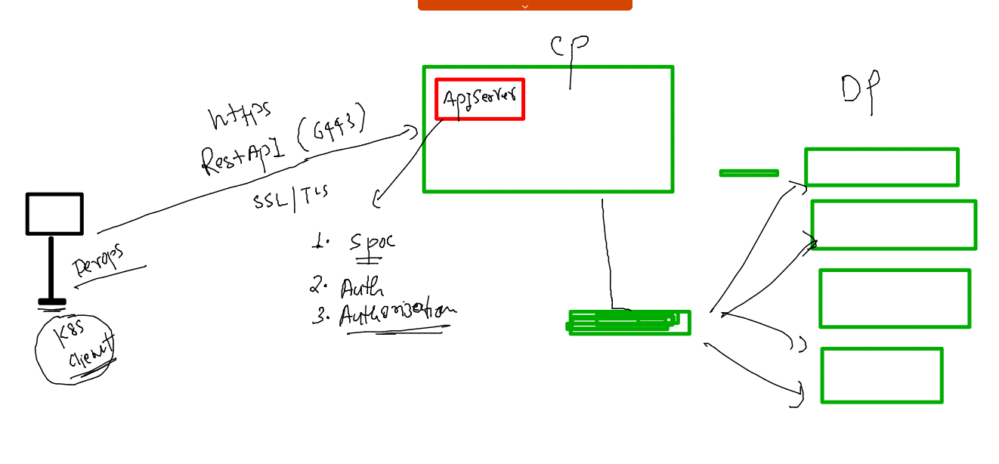

# dk-cisco-26sep2022

## Training Plan


### volume to containers concept 


## MYSQL db container example 

### MySQL volume Creation 

```
[ashu@ip-172-31-91-4 ~]$ docker  volume create ashudb-vol1 
ashudb-vol1
[ashu@ip-172-31-91-4 ~]$ docker  volume  ls
DRIVER    VOLUME NAME
local     ashudb-vol1
[ashu@ip-172-31-91-4 ~]$ docker  volume  inspect  ashudb-vol1 
[
    {
        "CreatedAt": "2022-09-28T04:35:56Z",
        "Driver": "local",
        "Labels": {},
        "Mountpoint": "/var/lib/docker/volumes/ashudb-vol1/_data",
        "Name": "ashudb-vol1",
        "Options": {},
        "Scope": "local"
    }
]
[ashu@ip-172-31-91-4 ~]$ 
```

### Creating Db container 

```
[ashu@ip-172-31-91-4 ~]$ docker  run -d --name ashudbc1  -e MYSQL_ROOT_PASSWORD="Ciscodb@098" -v ashudb-vol1:/var/lib/mysql/ mysql
88e1b9061fad29e33421bbdb1da390da03a302d7dc5f14a83bba6712f7170b07
[ashu@ip-172-31-91-4 ~]$ docker  ps
CONTAINER ID   IMAGE     COMMAND                  CREATED         STATUS                  PORTS                 NAMES
ab2cfbe3caf0   mysql     "docker-entrypoint.s…"   1 second ago    Up Less than a second   3306/tcp, 33060/tcp   sridhar1
326dc9a6c516   mysql     "docker-entrypoint.s…"   2 seconds ago   Up 1 second             3306/tcp, 33060/tcp   yashdbc1
ce266eb4320a   mysql     "docker-entrypoint.s…"   3 seconds ago   Up 2 seconds            3306/tcp, 33060/tcp   narasimhaMysqlDB
c7619646b82a   mysql     "docker-entrypoint.s…"   4 seconds ago   Up 2 seconds            3306/tcp, 33060/tcp   priyankadbc1
88e1b9061fad   mysql     "docker-entrypoint.s…"   5 seconds ago   Up 4 seconds            3306/tcp, 33060/tcp   ashudbc1
[ashu@ip-172-31-91-4 ~]$ 

```

### login to mysql Db container 

```
[ashu@ip-172-31-91-4 ~]$ docker  exec -it  ashudbc1   bash 
bash-4.4# 
bash-4.4# 
bash-4.4# mysql  -u  root -p
Enter password: 
Welcome to the MySQL monitor.  Commands end with ; or \g.
Your MySQL connection id is 8
Server version: 8.0.30 MySQL Community Server - GPL

Copyright (c) 2000, 2022, Oracle and/or its affiliates.

Oracle is a registered trademark of Oracle Corporation and/or its
affiliates. Other names may be trademarks of their respective
owners.

Type 'help;' or '\h' for help. Type '\c' to clear the current input statement.

mysql> 

```

### creating database in mysql server container 

```
bash-4.4# mysql  -u  root -p
Enter password: 
Welcome to the MySQL monitor.  Commands end with ; or \g.
Your MySQL connection id is 8
Server version: 8.0.30 MySQL Community Server - GPL

Copyright (c) 2000, 2022, Oracle and/or its affiliates.

Oracle is a registered trademark of Oracle Corporation and/or its
affiliates. Other names may be trademarks of their respective
owners.

Type 'help;' or '\h' for help. Type '\c' to clear the current input statement.

mysql> show databases;
+--------------------+
| Database           |
+--------------------+
| information_schema |
| mysql              |
| performance_schema |
| sys                |
+--------------------+
4 rows in set (0.01 sec)

mysql> create database ashudb;
Query OK, 1 row affected (0.01 sec)

mysql> show databases;
+--------------------+
| Database           |
+--------------------+
| ashudb             |
| information_schema |
| mysql              |
| performance_schema |
| sys                |
+--------------------+
5 rows in set (0.00 sec)


```

### cleaning up container 

```
[ashu@ip-172-31-91-4 ~]$ docker  kill  ashudbc1 ; docker rm ashudbc1 
ashudbc1
ashudbc1
[ashu@ip-172-31-91-4 ~]$ docker volume rm ashudb-vol1 
ashudb-vol1
[ashu@ip-172-31-91-4 ~]$ 
```

### MYSQL compose example 

```
version: '3.8' # compose file version 
networks: # creating network bridge 
  ashudb-br1: # name of bridge 
volumes: # for creating volume 
  ashudb-vol2: # name of volume 
services:
  ashudb-app: # service name 
    image: mysql 
    container_name: ashudbc2 
    environment: # passing env 
      MYSQL_ROOT_PASSWORD: "Ciscodb@098"
      MYSQL_USER: cisco
      MYSQL_PASSWORD: "New@098#"
    volumes: # attaching volume we created above 
    - ashudb-vol2:/var/lib/mysql/
    networks: # attaching network 
    - ashudb-br1 
    restart: always # to auto start container 
```


### lets run it 

```
[ashu@ip-172-31-91-4 ashu-compose]$ docker-compose  -f mysql.yaml  up -d 
[+] Running 2/2
 ⠿ Network ashu-compose_ashudb-br1  Created                                                        0.0s
 ⠿ Container ashudbc2               Started                                                        0.6s
[ashu@ip-172-31-91-4 ashu-compose]$ docker-compose  -f mysql.yaml  ps
NAME                COMMAND                  SERVICE             STATUS              PORTS
ashudbc2            "docker-entrypoint.s…"   ashudb-app          running             3306/tcp, 33060/tcp
[ashu@ip-172-31-91-4 ashu-compose]$ 

```

### Extending compose file 

```
version: '3.8' # compose file version 
networks: # creating network bridge 
  ashudb-br1: # name of bridge 
volumes: # for creating volume 
  ashudb-vol2: # name of volume 
services:
  ashuweb-app: # webapp for connecting db 
    image: adminer 
    container_name: ashuweb-c1 
    networks:
    - ashudb-br1 
    ports: # port forwarding 
    - 1234:8080 
    depends_on: # 
    - ashudb-app 
  ashudb-app: # service name of db 
    image: mysql 
    container_name: ashudbc2 
    environment: # passing env 
      MYSQL_ROOT_PASSWORD: "Ciscodb@098"
      MYSQL_USER: cisco
      MYSQL_PASSWORD: "New@098#"
    volumes: # attaching volume we created above 
    - ashudb-vol2:/var/lib/mysql/
    networks: # attaching network 
    - ashudb-br1 
    restart: always # to auto start container 
```

### rerun it 

```
[ashu@ip-172-31-91-4 ashu-compose]$ docker-compose  -f mysql.yaml  ps
NAME                COMMAND                  SERVICE             STATUS              PORTS
ashudbc2            "docker-entrypoint.s…"   ashudb-app          running             3306/tcp, 33060/tcp
[ashu@ip-172-31-91-4 ashu-compose]$ docker-compose  -f mysql.yaml  up -d
[+] Running 2/2
 ⠿ Container ashudbc2    Running                                                                   0.0s
 ⠿ Container ashuweb-c1  Started                                                                   0.6s
[ashu@ip-172-31-91-4 ashu-compose]$ docker-compose  -f mysql.yaml  ps
NAME                COMMAND                  SERVICE             STATUS              PORTS
ashudbc2            "docker-entrypoint.s…"   ashudb-app          running             3306/tcp, 33060/tcp
ashuweb-c1          "entrypoint.sh docke…"   ashuweb-app         running             0.0.0.0:1234->8080/tcp, :::1234->8080/tcp
[ashu@ip-172-31-91-4 ashu-compose]$ 

```

### volume 

```
version: '3.8' # compose file version 
networks: # creating network bridge 
  ashudb-br1: # name of bridge 
volumes: # for creating volume 
  ashudb-vol2: # name of volume 
services:
  ashuweb-app: # webapp for connecting db 
    image: adminer 
    container_name: ashuweb-c1 
    networks:
    - ashudb-br1 
    ports: # port forwarding 
    - 1234:8080 
    depends_on: # 
    - ashudb-app 
  ashudb-app: # service name of db 
    image: mysql 
    container_name: ashudbc2 
    environment: # passing env 
      MYSQL_ROOT_PASSWORD: "Ciscodb@098"
      MYSQL_USER: cisco
      MYSQL_PASSWORD: "New@098#"
    volumes: # attaching volume we created above 
    - /home/ashu/ashu-images/ashu-compose/db-storage:/var/lib/mysql/
    networks: # attaching network 
    - ashudb-br1 
    restart: always # to auto start container 
```

### deployment of containerized app in prod gonna face below problems 


## Intro to container orchestration 


## k8s architecture  understanding Level 1 


### setup methods for k8s 


### kube-apiserver on control plane 



### schedular in control plane 


### etcd in control plane 


## TIme for setup k8s client 

### use link 
[click_here](https://kubernetes.io/docs/tasks/tools/install-kubectl-linux/)


### installing on linux machine 

```
[root@ip-172-31-91-4 ~]# curl -LO "https://dl.k8s.io/release/$(curl -L -s https://dl.k8s.io/release/stable.txt)/bin/linux/amd64/kubectl"
  % Total    % Received % Xferd  Average Speed   Time    Time     Time  Current
                                 Dload  Upload   Total   Spent    Left  Speed
100   138  100   138    0     0   3137      0 --:--:-- --:--:-- --:--:--  3209
100 42.9M  100 42.9M    0     0  96.8M      0 --:--:-- --:--:-- --:--:--  155M
[root@ip-172-31-91-4 ~]# ls
ddagent-install.log  kubectl  test
[root@ip-172-31-91-4 ~]# mv kubectl /usr/bin/
[root@ip-172-31-91-4 ~]# chmod +x /usr/bin/kubectl 
[root@ip-172-31-91-4 ~]# 


```
### lets test some api request 


```
[ashu@ip-172-31-91-4 ashu-compose]$ kubectl  version  -o yaml 
clientVersion:
  buildDate: "2022-09-21T14:33:49Z"
  compiler: gc
  gitCommit: 5835544ca568b757a8ecae5c153f317e5736700e
  gitTreeState: clean
  gitVersion: v1.25.2
  goVersion: go1.19.1
  major: "1"
  minor: "25"
  platform: linux/amd64
kustomizeVersion: v4.5.7

The connection to the server localhost:8080 was refused - did you specify the right host or port?
[ashu@ip-172-31-91-4 ashu-compose]$ kubectl  get  nodes
The connection to the server localhost:8080 was refused - did you specify the right host or port?
[ashu@ip-172-31-91-4 ashu-compose]$ 

```

### lets send first successful request to apiServer 

```
[ashu@ip-172-31-91-4 ashu-images]$ kubectl   get  nodes  --kubeconfig admin.conf 
NAME            STATUS   ROLES           AGE    VERSION
control-plane   Ready    control-plane   101m   v1.25.2
minion-node-1   Ready    <none>          100m   v1.25.2
minion-node-2   Ready    <none>          99m    v1.25.2
minion-node-3   Ready    <none>          99m    v1.25.2
[ashu@ip-172-31-91-4 ashu-images]$ 
```

### copy kubeconfig file to homedirectoy 

```
[ashu@ip-172-31-91-4 ashu-images]$ mkdir  ~/.kube 
mkdir: cannot create directory ‘/home/ashu/.kube’: File exists
[ashu@ip-172-31-91-4 ashu-images]$ 
[ashu@ip-172-31-91-4 ashu-images]$ cp  -v admin.conf   ~/.kube/config  
‘admin.conf’ -> ‘/home/ashu/.kube/config’
[ashu@ip-172-31-91-4 ashu-images]$ 
[ashu@ip-172-31-91-4 ashu-images]$ kubectl  get  nodes 
NAME            STATUS   ROLES           AGE    VERSION
control-plane   Ready    control-plane   105m   v1.25.2
minion-node-1   Ready    <none>          104m   v1.25.2
minion-node-2   Ready    <none>          103m   v1.25.2
minion-node-3   Ready    <none>          103m   v1.25.2
```


