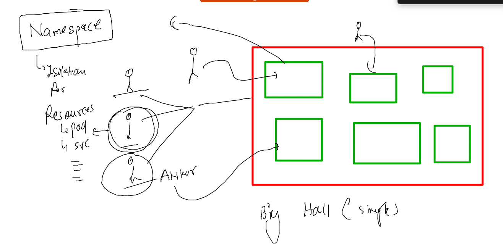

# dk-cisco-26sep2022

## Training Plan


## Networking in k8s 


### POd networking 


### Calico Node agents and controllers creates distributed bridge 


### deploying sample pod and checking networking 

```
[ashu@ip-172-31-91-4 ~]$ kubectl  run  ashupod1  --image=alpine --command ping fb.com 
pod/ashupod1 created
[ashu@ip-172-31-91-4 ~]$ kubectl  get  po 
NAME              READY   STATUS        RESTARTS   AGE
ankurpod-123      1/1     Running       0          58s
ashupod1          1/1     Running       0          9s
bharti-123        1/1     Running       0          17s
narasimhapod1     1/1     Running       0          3s
priyankapod-123   1/1     Terminating   0          38s
sridhar           1/1     Running       0          3s
[ashu@ip-172-31-91-4 ~]$ kubectl  get  po -o wide
NAME            READY   STATUS    RESTARTS   AGE   IP                NODE            NOMINATED NODE   READINESS GATES
ankurpod-123    1/1     Running   0          82s   192.168.97.90     minion-node-2   <none>           <none>
ashupod1        1/1     Running   0          33s   192.168.174.221   minion-node-3   <none>           <none>
bharti-123      1/1     Running   0          41s   192.168.97.91     minion-node-2   <none>           <none>
mufimpod1       1/1     Running   0          10s   192.168.97.93     minion-node-2   <none>           <none>
narasimhapod1   1/1     Running   0          27s   192.168.174.222   minion-node-3   <none>           <none>
sridhar         1/1     Running   0          27s   192.168.97.92     minion-node-2   <none>           <none>
yashpod1        1/1     Running   0          12s   192.168.174.223   minion-node-3   <none>           <none>
[ashu@ip-172-31-91-4 ~]$ kubectl  describe  pod ashupod1
Name:             ashupod1
Namespace:        default
Priority:         0
Service Account:  default
Node:             minion-node-3/172.31.84.128
Start Time:       Thu, 29 Sep 2022 04:54:58 +0000
Labels:           run=ashupod1
Annotations:      cni.projectcalico.org/containerID: 01b8eeb3d3ae7400b27ea7748db2bcef47a7df15e8a07c03132e0ca4915c2134
                  cni.projectcalico.org/podIP: 192.168.174.221/32
                  cni.projectcalico.org/podIPs: 192.168.174.221/32
Status:           Running
IP:               192.168.174.221

```

### pods can communicate to each other by default 

```
[ashu@ip-172-31-91-4 ~]$ kubectl  get  po -o wide
NAME            READY   STATUS    RESTARTS   AGE     IP                NODE            NOMINATED NODE   READINESS GATES
ankurpod-123    1/1     Running   0          3m36s   192.168.97.90     minion-node-2   <none>           <none>
ashupod1        1/1     Running   0          2m47s   192.168.174.221   minion-node-3   <none>           <none>
balajin-pod1    1/1     Running   0          103s    192.168.138.75    minion-node-1   <none>           <none>
bharti-123      1/1     Running   0          2m55s   192.168.97.91     minion-node-2   <none>           <none>
mufimpod1       1/1     Running   0          2m24s   192.168.97.93     minion-node-2   <none>           <none>
narasimhapod1   1/1     Running   0          2m41s   192.168.174.222   minion-node-3   <none>           <none>
prampod         1/1     Running   0          2m6s    192.168.138.74    minion-node-1   <none>           <none>
priyankpod1     1/1     Running   0          106s    192.168.97.94     minion-node-2   <none>           <none>
sridhar         1/1     Running   0          2m41s   192.168.97.92     minion-node-2   <none>           <none>
steve-pod1      2/2     Running   0          56s     192.168.174.226   minion-node-3   <none>           <none>
suhas-123       1/1     Running   0          62s     192.168.174.225   minion-node-3   <none>           <none>
yashpod1        1/1     Running   0          2m26s   192.168.174.223   minion-node-3   <none>           <none>
[ashu@ip-172-31-91-4 ~]$ 
[ashu@ip-172-31-91-4 ~]$ 
[ashu@ip-172-31-91-4 ~]$ kubectl  exec -it  ashupod1  -- sh 
/ # ifconfig 
eth0      Link encap:Ethernet  HWaddr 3A:E0:61:3B:C2:02  
          inet addr:192.168.174.221  Bcast:0.0.0.0  Mask:255.255.255.255
          inet6 addr: fe80::38e0:61ff:fe3b:c202/64 Scope:Link
          UP BROADCAST RUNNING MULTICAST  MTU:8981  Metric:1
          RX packets:219 errors:0 dropped:0 overruns:0 frame:0
          TX packets:226 errors:0 dropped:1 overruns:0 carrier:0
          collisions:0 txqueuelen:0 
          RX bytes:22236 (21.7 KiB)  TX bytes:21142 (20.6 KiB)

lo        Link encap:Local Loopback  
          inet addr:127.0.0.1  Mask:255.0.0.0
          inet6 addr: ::1/128 Scope:Host
          UP LOOPBACK RUNNING  MTU:65536  Metric:1
          RX packets:0 errors:0 dropped:0 overruns:0 frame:0
          TX packets:0 errors:0 dropped:0 overruns:0 carrier:0
          collisions:0 txqueuelen:1000 
          RX bytes:0 (0.0 B)  TX bytes:0 (0.0 B)

/ # ping  192.168.97.90
PING 192.168.97.90 (192.168.97.90): 56 data bytes
64 bytes from 192.168.97.90: seq=0 ttl=62 time=0.576 ms
64 bytes from 192.168.97.90: seq=1 ttl=62 time=1.041 ms
64 bytes from 192.168.97.90: seq=2 ttl=62 time=0.616 ms
^C
--- 192.168.97.90 ping statistics ---
3 packets transmitted, 3 packets received, 0% packet loss
round-trip min/avg/max = 0.576/0.744/1.041 ms
/ # ping  192.168.138.75
PING 192.168.138.75 (192.168.138.75): 56 data bytes
64 bytes from 192.168.138.75: seq=0 ttl=62 time=0.550 ms
64 bytes from 192.168.138.75: seq=1 ttl=62 time=0.502 ms
64 bytes from 192.168.138.75: seq=2 ttl=62 time=0.610 ms
^C
--- 192.168.138.75 ping statistics ---
3 packets transmitted, 3 packets received, 0% packet loss
round-trip min/avg/max = 0.502/0.554/0.610 ms
/ # 
[ashu@ip-172-31-91-4 ~]$ 

```

### calico installation on k8s link

[click_here](https://projectcalico.docs.tigera.io/getting-started/kubernetes/)


## K8s InterMediate Networking 

### External Lb to NOde--Internal-lB ---POd 


### Internal LB can be created by Service Resources in k8s 


### Concept to labels to update Internal lB db with POdIP:port 


## Practise Networking 

### creating webapp pod 

```
kubectl run ashuwebapp --image=docker.io/dockerashu/ciscoapp:v1  --port 80 --dry-run=client   -o yaml  >webapp.yaml 
```

### modified YAML 

```
apiVersion: v1
kind: Pod
metadata: # info about Resource like pod 
  creationTimestamp: null
  labels: # label of my pod 
    x1: helloashu # here x1 is key and helloashu is value 
  name: ashuwebapp # name of pod 
spec:
  containers:
  - image: docker.io/dockerashu/ciscoapp:v1
    name: ashuwebapp
    ports:
    - containerPort: 80
    resources: {}
  dnsPolicy: ClusterFirst
  restartPolicy: Always
status: {}

```

### lets deploy it 

```
[ashu@ip-172-31-91-4 k8s-app-deploy]$ ls
ashu-pod1.yaml  auto.yaml  logs.txt  task1.yaml  webapp.yaml
[ashu@ip-172-31-91-4 k8s-app-deploy]$ kubectl apply -f webapp.yaml 
pod/ashuwebapp created
[ashu@ip-172-31-91-4 k8s-app-deploy]$ kubectl  get po 
NAME          READY   STATUS              RESTARTS   AGE
ashuwebapp    0/1     ContainerCreating   0          3s
sriwebapp     1/1     Running             0          2s
stevewebapp   1/1     Running             0          19s
[ashu@ip-172-31-91-4 k8s-app-deploy]$ kubectl  get po --show-labels
NAME              READY   STATUS    RESTARTS   AGE   LABELS
ashuwebapp        1/1     Running   0          7s    x1=helloashu
narasimhawebapp   1/1     Running   0          2s    x1=hellonarasimha
priyankawebapp    1/1     Running   0          3s    x1=hellopriyanka
sriwebapp         1/1     Running   0          6s    run=sriwebapp,x1=hellosri
stevewebapp       1/1     Running   0          23s   app-label=steve-webapp
```

### Introduction to Internal lB in k8s -- created by service resource under api v1 


### Service type with expose app options 


### NodePOrt vs LoadBalancer service 


### creating nodeport service 

```
kubectl  create   service  nodeport  ashu-internal-lb1   --tcp 1234:80  --dry-run=client -o yaml >nodeport1.yaml 
```
###


### creating serivces and checking EPs

```
[ashu@ip-172-31-91-4 k8s-app-deploy]$ kubectl apply -f nodeport1.yaml 
service/ashu-internal-lb1 created
[ashu@ip-172-31-91-4 k8s-app-deploy]$ kubectl   get  services
NAME                TYPE        CLUSTER-IP      EXTERNAL-IP   PORT(S)          AGE
ashu-internal-lb1   NodePort    10.99.248.229   <none>        1234:32298/TCP   11s
kubernetes          ClusterIP   10.96.0.1       <none>        443/TCP          22h
[ashu@ip-172-31-91-4 k8s-app-deploy]$ 
[ashu@ip-172-31-91-4 k8s-app-deploy]$ kubectl   get  endpoints 
NAME                 ENDPOINTS           AGE
ashu-internal-lb1    <none>              35s
kubernetes           172.31.87.27:6443   22h
sri-int-lb           <none>              22s
suhas-internal-lb1   <none>              15s
```


### updating selector section and reapply it 

```
apiVersion: v1
kind: Service
metadata:
  creationTimestamp: null
  labels: # label of service 
    app: ashu-internal-lb1
  name: ashu-internal-lb1 # name of service 
spec:
  ports:
  - name: 1234-80
    port: 1234 # internal LB port 
    protocol: TCP
    targetPort: 80 # target pod application port 
  selector: # pod finder using below given label 
    x1: helloashu # ashuapp pod label 
  type: NodePort # type of service 
status:
  loadBalancer: {}

```

### 

```
 kubectl  apply -f nodeport1.yaml 
 [ashu@ip-172-31-91-4 k8s-app-deploy]$ kubectl   get  svc  ashu-internal-lb1 
NAME                TYPE       CLUSTER-IP      EXTERNAL-IP   PORT(S)          AGE
ashu-internal-lb1   NodePort   10.99.248.229   <none>        1234:32298/TCP   5m53s
[ashu@ip-172-31-91-4 k8s-app-deploy]$ 
[ashu@ip-172-31-91-4 k8s-app-deploy]$ kubectl  get  ep   ashu-internal-lb1 
NAME                ENDPOINTS          AGE
ashu-internal-lb1   192.168.97.95:80   6m
[ashu@ip-172-31-91-4 k8s-app-deploy]$ kubectl   get  po -o wide  |  grep ashu
ashuwebapp        1/1     Running   0          26m     192.168.97.95     minion-node-2   <none>           <none>
```

### External LB for single app 


## 3 problems as of current section 


### Namespace in k8s 



### creating namespace 

```
ashu@ip-172-31-91-4 ~]$ kubectl   get  namespaces 
NAME              STATUS   AGE
default           Active   24h
kube-node-lease   Active   24h
kube-public       Active   24h
kube-system       Active   24h
[ashu@ip-172-31-91-4 ~]$ kubectl  create  namespace  ashu-apps 
namespace/ashu-apps created
[ashu@ip-172-31-91-4 ~]$ kubectl  get  ns
NAME              STATUS   AGE
ashu-apps         Active   4s
default           Active   24h
kube-node-lease   Active   24h
kube-public       Active   24h
kube-system       Active   24h
[ashu@ip-172-31-91-4 ~]$ 

```

### setting default namespace  & checking 

```
ashu@ip-172-31-91-4 ~]$ kubectl  config set-context --current --namespace  ashu-apps 
Context "kubernetes-admin@kubernetes" modified.
[ashu@ip-172-31-91-4 ~]$ 


[ashu@ip-172-31-91-4 ~]$ kubectl  config get-contexts 
CURRENT   NAME                          CLUSTER      AUTHINFO           NAMESPACE
*         kubernetes-admin@kubernetes   kubernetes   kubernetes-admin   ashu-apps
[ashu@ip-172-31-91-4 ~]$ 


```

### checking resources here 

```
[ashu@ip-172-31-91-4 ~]$ kubectl   get  pods
No resources found in ashu-apps namespace.
[ashu@ip-172-31-91-4 ~]$ 
[ashu@ip-172-31-91-4 ~]$ kubectl   get  svc
No resources found in ashu-apps namespace.
[ashu@ip-172-31-91-4 ~]$ 

```

### being super user in k8s we can access other namespace data also 

```
ashu@ip-172-31-91-4 ~]$ kubectl  get po -n default 
NAME              READY   STATUS             RESTARTS        AGE
ankurwebapp       1/1     Running            0               26m
balaj-webapp      1/1     Running            0               29m
mufimwebapp1      1/1     Running            0               15m
narasimhawebapp   1/1     Running            0               22m
pramodwebapp      0/1     CrashLoopBackOff   9 (2m43s ago)   24m
pramodwebapp1     1/1     Running            0               14m
priyankapod2      1/1     Running            0               29m
sridharpod        1/1     Running            0               21m
stevewebapp       1/1     Running            0               31m
suhas-webapp      1/1     Running            0               28m
yashwebapp        1/1     Running            0               22m
[ashu@ip-172-31-91-4 ~]$ kubectl  delete pod --all -n default 
pod "ankurwebapp" deleted
pod "balaj-webapp" deleted
pod "mufimwebapp1" deleted
pod "narasimhawebapp" deleted
pod "pramodwebapp" deleted
pod "pramodwebapp1" deleted
pod "priyankapod2" deleted

```
### Scaling in Pod 


### K8s Controllers 


### creating deployment YAML 

```
 kubectl  create  deployment  ashu-deploy  --image=docker.io/dockerashu/ciscoapp:v1  --port 80  --dry-run=client -o yaml  >deployment1.yaml 
```

### lets deploy it 

```
[ashu@ip-172-31-91-4 k8s-app-deploy]$ kubectl  apply -f deployment1.yaml 
deployment.apps/ashu-deploy created
[ashu@ip-172-31-91-4 k8s-app-deploy]$ kubectl  get  deployment 
NAME          READY   UP-TO-DATE   AVAILABLE   AGE
ashu-deploy   1/1     1            1           10s
[ashu@ip-172-31-91-4 k8s-app-deploy]$ kubectl   get  po 
NAME                           READY   STATUS    RESTARTS   AGE
ashu-deploy-76cd4cf9c9-hlchp   1/1     Running   0          21s
[ashu@ip-172-31-91-4 k8s-app-deploy]$ 

```

### Now deployment based pod is having recreation nature 

```
 546  kubectl config get-contexts 
[ashu@ip-172-31-91-4 k8s-app-deploy]$ kubectl  get po -o wide
NAME                           READY   STATUS    RESTARTS   AGE     IP                NODE            NOMINATED NODE   READINESS GATES
ashu-deploy-76cd4cf9c9-hlchp   1/1     Running   0          2m47s   192.168.174.245   minion-node-3   <none>           <none>
[ashu@ip-172-31-91-4 k8s-app-deploy]$ 
[ashu@ip-172-31-91-4 k8s-app-deploy]$ kubectl  delete  pod  ashu-deploy-76cd4cf9c9-hlchp
pod "ashu-deploy-76cd4cf9c9-hlchp" deleted
[ashu@ip-172-31-91-4 k8s-app-deploy]$ kubectl  get po -o wide
NAME                           READY   STATUS    RESTARTS   AGE   IP                NODE            NOMINATED NODE   READINESS GATES
ashu-deploy-76cd4cf9c9-nxc99   1/1     Running   0          23s   192.168.174.251   minion-node-3   <none>           <none>
[ashu@ip-172-31-91-4 k8s-app-deploy]$ 

```

### creating nodeport service 

```
kubectl  create  service nodeport  ashulb2 --tcp 1234:80 --dry-run=client -o yaml >nodeport2.yaml 

```

### updating label of pod from deployment to service selector section 

```
apiVersion: v1
kind: Service
metadata:
  creationTimestamp: null
  labels:
    app: ashulb2
  name: ashulb2
spec:
  ports:
  - name: 1234-80
    port: 1234
    protocol: TCP
    targetPort: 80
  selector: # pod finder using below label 
    app: ashu-deploy # label of pod 
  type: NodePort
status:
  loadBalancer: {}

```

### 

```
[ashu@ip-172-31-91-4 k8s-app-deploy]$ kubectl  apply -f nodeport2.yaml 
service/ashulb2 created
[ashu@ip-172-31-91-4 k8s-app-deploy]$ kubectl   get  svc
NAME      TYPE       CLUSTER-IP       EXTERNAL-IP   PORT(S)          AGE
ashulb2   NodePort   10.109.174.170   <none>        1234:32194/TCP   5s
[ashu@ip-172-31-91-4 k8s-app-deploy]$ kubectl   get  ep
NAME      ENDPOINTS            AGE
ashulb2   192.168.174.251:80   9s
[ashu@ip-172-31-91-4 k8s-app-deploy]$ 
```


### scaling pod manually 

```
[ashu@ip-172-31-91-4 k8s-app-deploy]$ kubectl  get  deploy 
NAME          READY   UP-TO-DATE   AVAILABLE   AGE
ashu-deploy   1/1     1            1           11m
[ashu@ip-172-31-91-4 k8s-app-deploy]$ kubectl scale deployment  ashu-deploy --replicas=3
deployment.apps/ashu-deploy scaled
[ashu@ip-172-31-91-4 k8s-app-deploy]$ kubectl  get  deploy 
NAME          READY   UP-TO-DATE   AVAILABLE   AGE
ashu-deploy   3/3     3            3           12m
[ashu@ip-172-31-91-4 k8s-app-deploy]$ kubectl  get  po
NAME                           READY   STATUS    RESTARTS   AGE
ashu-deploy-76cd4cf9c9-gn6dc   1/1     Running   0          11s
ashu-deploy-76cd4cf9c9-nxc99   1/1     Running   0          9m10s
ashu-deploy-76cd4cf9c9-w58p4   1/1     Running   0          11s
```

### scaling pod will automatically update EP 

```
  574  kubectl scale deployment  ashu-deploy --replicas=3
  575  kubectl  get  deploy 
  576  kubectl  get  po
  577  history 
  578  kubectl  get  po 
  579  kubectl  get  po -o wide
  580  history 
[ashu@ip-172-31-91-4 k8s-app-deploy]$ kubectl  get  svc
NAME      TYPE       CLUSTER-IP       EXTERNAL-IP   PORT(S)          AGE
ashulb2   NodePort   10.109.174.170   <none>        1234:32194/TCP   4m23s
[ashu@ip-172-31-91-4 k8s-app-deploy]$ kubectl  get  ep 
NAME      ENDPOINTS                                                AGE
ashulb2   192.168.138.83:80,192.168.174.251:80,192.168.97.125:80   4m29s
```

### Deleting svc 

```
[ashu@ip-172-31-91-4 k8s-app-deploy]$ kubectl  get  svc
NAME      TYPE       CLUSTER-IP       EXTERNAL-IP   PORT(S)          AGE
ashulb2   NodePort   10.109.174.170   <none>        1234:32194/TCP   8m59s
[ashu@ip-172-31-91-4 k8s-app-deploy]$ kubectl  delete  svc  ashulb2 
service "ashulb2" deleted
[ashu@ip-172-31-91-4 k8s-app-deploy]$ kubectl  get  ep
No resources found in ashu-apps namespace.
[ashu@ip-172-31-91-4 k8s-app-deploy]$ 


```

### auto match label of pod to selector of service 

```
[ashu@ip-172-31-91-4 k8s-app-deploy]$ kubectl  get  deploy 
NAME          READY   UP-TO-DATE   AVAILABLE   AGE
ashu-deploy   1/1     1            1           19m
[ashu@ip-172-31-91-4 k8s-app-deplo
[ashu@ip-172-31-91-4 k8s-app-deploy]$ 
[ashu@ip-172-31-91-4 k8s-app-deploy]$ 
[ashu@ip-172-31-91-4 k8s-app-deploy]$ kubectl expose deployment  ashu-deploy --type NodePort --port 80 --name ashulb2 
service/ashulb2 exposed
[ashu@ip-172-31-91-4 k8s-app-deploy]$ kubectl get  svc 
NAME      TYPE       CLUSTER-IP     EXTERNAL-IP   PORT(S)        AGE
ashulb2   NodePort   10.96.146.45   <none>        80:31458/TCP   5s
[ashu@ip-172-31-91-4 k8s-app-deploy]$ kubectl get  ep 
NAME      ENDPOINTS          AGE
ashulb2   192.168.97.67:80   9s
[ashu@ip-172-31-91-4 k8s-app-deploy]$ 


```

### autoscaling need ??


### Deploy a private image to k8s 

```
[ashu@ip-172-31-91-4 k8s-app-deploy]$ kubectl  create  deployment ashu-appnew --image=phx.ocir.io/axmbtg8judkl/ciscoapp:ashuapp1   --port 8080 --dry-run=client -o yaml >private_deployment.yaml 
[ashu@ip-172-31-91-4 k8s-app-deploy]$ kubectl  apply -f private_deployment.yaml 
deployment.apps/ashu-appnew created
[ashu@ip-172-31-91-4 k8s-app-deploy]$ kubectl  get  po 
NAME                           READY   STATUS         RESTARTS   AGE
ashu-appnew-7f5d799c5d-pxprt   0/1     ErrImagePull   0          4s
[ashu@ip-172-31-91-4 k8s-app-deploy]$ 


```
## Introduction to Secret 


### secret creating 

```
[ashu@ip-172-31-91-4 k8s-app-deploy]$ kubectl  create  secret  
Create a secret using specified subcommand.

Available Commands:
  docker-registry   Create a secret for use with a Docker registry
  generic           Create a secret from a local file, directory, or literal value
  tls               Create a TLS secret

=====
kubectl  create  secret   docker-registry   ashu-sec  --docker-server=phx.ocir.io             --docker-username="a8judkl/learl.com" --docker-password=";IDj"  --dry-run=client -o yaml     >secret1.yaml 
```

### creating it 

```
ashu@ip-172-31-91-4 k8s-app-deploy]$ kubectl apply -f secret1.yaml 
secret/ashu-sec created
[ashu@ip-172-31-91-4 k8s-app-deploy]$ 
[ashu@ip-172-31-91-4 k8s-app-deploy]$ kubectl  get  secret  
NAME       TYPE                             DATA   AGE
ashu-sec   kubernetes.io/dockerconfigjson   1      4s
```

### redeploy it 

```
apiVersion: apps/v1
kind: Deployment
metadata:
  creationTimestamp: null
  labels:
    app: ashu-appnew
  name: ashu-appnew
spec:
  replicas: 1
  selector:
    matchLabels:
      app: ashu-appnew
  strategy: {}
  template: # for pod creation purpose 
    metadata:
      creationTimestamp: null
      labels:
        app: ashu-appnew
    spec:
      imagePullSecrets: # calling secret from current namesapce 
      - name: ashu-sec 
      containers:
      - image: phx.ocir.io/axmbtg8judkl/ciscoapp:ashuapp1
        name: ciscoapp
        ports:
        - containerPort: 8080
        resources: {}
status: {}

```

### 

```
[ashu@ip-172-31-91-4 k8s-app-deploy]$ kubectl apply -f  private_deployment.yaml 
deployment.apps/ashu-appnew configured
[ashu@ip-172-31-91-4 k8s-app-deploy]$ kubectl  get  deploy 
NAME          READY   UP-TO-DATE   AVAILABLE   AGE
ashu-appnew   0/1     1            0           13m
[ashu@ip-172-31-91-4 k8s-app-deploy]$ kubectl   get  po 
NAME                           READY   STATUS              RESTARTS   AGE
ashu-appnew-7b9cfc99f-sdt4z    0/1     ContainerCreating   0          7s
ashu-appnew-7f5d799c5d-pxprt   0/1     ImagePullBackOff    0          14m
[ashu@ip-172-31-91-4 k8s-app-deploy]$ kubectl   get  po 
NAME                          READY   STATUS    RESTARTS   AGE
ashu-appnew-7b9cfc99f-sdt4z   1/1     Running   0          18s
[ashu@ip-172-31-91-4 k8s-app-deploy]$ 


```

### creating service 

```
[ashu@ip-172-31-91-4 k8s-app-deploy]$ kubectl  get  deploy 
NAME          READY   UP-TO-DATE   AVAILABLE   AGE
ashu-appnew   1/1     1            1           42m
[ashu@ip-172-31-91-4 k8s-app-deploy]$ kubectl  expose deploy  ashu-appnew  --type NodePort --port 8080 --name ashulb3  --dry-run=client -o yaml >np4.yaml 
[ashu@ip-172-31-91-4 k8s-app-deploy]$ kubectl  apply -f np4.yaml 
service/ashulb3 created
[ashu@ip-172-31-91-4 k8s-app-deploy]$ kubectl   get  svc
NAME      TYPE       CLUSTER-IP       EXTERNAL-IP   PORT(S)          AGE
ashulb3   NodePort   10.102.159.129   <none>        8080:31161/TCP   3s
[ashu@ip-172-31-91-4 k8s-app-deploy]$ kubectl   get  ep
NAME      ENDPOINTS             AGE
ashulb3   192.168.138.96:8080   6s
```

### Introduction to k8s package manager -- HELM 


### Installing helm on linux client machine 

```
[root@ip-172-31-91-4 ~]# wget  https://get.helm.sh/helm-v3.10.0-linux-amd64.tar.gz
--2022-09-29 11:18:57--  https://get.helm.sh/helm-v3.10.0-linux-amd64.tar.gz
Resolving get.helm.sh (get.helm.sh)... 152.195.19.97, 2606:2800:11f:1cb7:261b:1f9c:2074:3c
Connecting to get.helm.sh (get.helm.sh)|152.195.19.97|:443... connected.
HTTP request sent, awaiting response... 200 OK
Length: 14530566 (14M) [application/x-tar]
Saving to: 'helm-v3.10.0-linux-amd64.tar.gz'

100%[==================================================================================================================>] 14,530,566  --.-K/s   in 0.1s    

2022-09-29 11:18:57 (101 MB/s) - 'helm-v3.10.0-linux-amd64.tar.gz' saved [14530566/14530566]

[root@ip-172-31-91-4 ~]# ls
ddagent-install.log  helm-v3.10.0-linux-amd64.tar.gz  test
[root@ip-172-31-91-4 ~]# tar xvzf helm-v3.10.0-linux-amd64.tar.gz 
linux-amd64/
linux-amd64/helm
linux-amd64/LICENSE
linux-amd64/README.md
[root@ip-172-31-91-4 ~]# ls
ddagent-install.log  helm-v3.10.0-linux-amd64.tar.gz  linux-amd64  test
[root@ip-172-31-91-4 ~]# cd linux-amd64/
[root@ip-172-31-91-4 linux-amd64]# ls
LICENSE  README.md  helm
[root@ip-172-31-91-4 linux-amd64]# mv helm  /usr/bin/
[root@ip-172-31-91-4 linux-amd64]# 

```


### checking its installation 

```
[ashu@ip-172-31-91-4 k8s-app-deploy]$ helm version 
WARNING: Kubernetes configuration file is group-readable. This is insecure. Location: /home/ashu/.kube/config
WARNING: Kubernetes configuration file is world-readable. This is insecure. Location: /home/ashu/.kube/config
version.BuildInfo{Version:"v3.10.0", GitCommit:"ce66412a723e4d89555dc67217607c6579ffcb21", GitTreeState:"clean", GoVersion:"go1.18.6"}


[ashu@ip-172-31-91-4 k8s-app-deploy]$ chmod  400  ~/.kube/config 
[ashu@ip-172-31-91-4 k8s-app-deploy]$ helm version 
version.BuildInfo{Version:"v3.10.0", GitCommit:"ce66412a723e4d89555dc67217607c6579ffcb21", GitTreeState:"clean", GoVersion:"go1.18.6"}
[ashu@ip-172-31-91-4 k8s-app-deploy]$ 
```


### Hub Vs Repo 

```
 560  helm search  hub 
  561  history 
  562  helm search  hub   mysql 
  563  helm search  hub  nginx 
  564  history 
[ashu@ip-172-31-91-4 ~]$ helm repo list
Error: no repositories to show
[ashu@ip-172-31-91-4 ~]$ 
[ashu@ip-172-31-91-4 ~]$ 
[ashu@ip-172-31-91-4 ~]$ helm repo add  ashu-repo https://charts.bitnami.com/bitnami
"ashu-repo" has been added to your repositories
[ashu@ip-172-31-91-4 ~]$ 
[ashu@ip-172-31-91-4 ~]$ helm repo list
NAME     	URL                               
ashu-repo	https://charts.bitnami.com/bitnami
[ashu@ip-172-31-91-4 ~]$ 
[ashu@ip-172-31-91-4 ~]$ 

```

### searching packages on Repo 

```
ashu@ip-172-31-91-4 ~]$ helm search  repo  mysql 
NAME                    	CHART VERSION	APP VERSION	DESCRIPTION                                       
ashu-repo/mysql         	9.3.4        	8.0.30     	MySQL is a fast, reliable, scalable, and easy t...
ashu-repo/phpmyadmin    	10.3.4       	5.2.0      	phpMyAdmin is a free software tool written in P...
ashu-repo/mariadb       	11.3.1       	10.6.10    	MariaDB is an open source, community-developed ...
ashu-repo/mariadb-galera	7.4.3        	10.6.10    	MariaDB Galera is a multi-primary database clus...
[ashu@ip-172-31-91-4 ~]$ helm search  repo  nginx 
NAME                              	CHART VERSION	APP VERSION	DESCRIPTION                                       
ashu-mirantis/nginx               	0.1.0        	1.16.0     	A NGINX Docker Community based Helm chart for K...
ashu-repo/nginx                   	13.2.6       	1.23.1     	NGINX Open Source is a web server that can be a...
ashu-repo/nginx-ingress-controller	9.3.13       	1.3.1      	NGINX Ingress Controller is an Ingress controll...
ashu-repo/nginx-intel             	2.1.5        	0.4.7      	NGINX Open Source for Intel is a lightweight se...
ashu-repo/kong                    	5.0.2        	2.7.0      	Kong is a scalable, open source API layer (aka ...
[ashu@ip-172-31-91-4 ~]$ 

```

### deploying nginx app using helm form Repo 

```
[ashu@ip-172-31-91-4 k8s-app-deploy]$ helm repo ls 
NAME            URL                               
ashu-repo       https://charts.bitnami.com/bitnami
ashu-mirantis   https://charts.mirantis.com       
[ashu@ip-172-31-91-4 k8s-app-deploy]$ 
[ashu@ip-172-31-91-4 k8s-app-deploy]$ 
[ashu@ip-172-31-91-4 k8s-app-deploy]$ helm  install  ashu-web-app    ashu-repo/nginx  
NAME: ashu-web-app
LAST DEPLOYED: Thu Sep 29 11:38:15 2022
NAMESPACE: ashu-apps
STATUS: deployed
REVISION: 1
TEST SUITE: None
NOTES:
CHART NAME: nginx
CHART VERSION: 13.2.6
APP VERSION: 1.23.1

** Please be patient while the 
```

### check running deployment in k8s by your helm 

```
ashu@ip-172-31-91-4 k8s-app-deploy]$ helm ls
NAME            NAMESPACE       REVISION        UPDATED                                 STATUS          CHART           APP VERSION
ashu-web-app    ashu-apps       1               2022-09-29 11:38:15.398889993 +0000 UTC deployed        nginx-13.2.6    1.23.1     
```

### check it by k8s 

```
[ashu@ip-172-31-91-4 k8s-app-deploy]$ 
[ashu@ip-172-31-91-4 k8s-app-deploy]$ kubectl  get  deployment 
NAME                 READY   UP-TO-DATE   AVAILABLE   AGE
ashu-web-app-nginx   1/1     1            1           4m37s
[ashu@ip-172-31-91-4 k8s-app-deploy]$ kubectl   get  svc
NAME                 TYPE           CLUSTER-IP      EXTERNAL-IP   PORT(S)        AGE
ashu-web-app-nginx   LoadBalancer   10.109.57.185   <pending>     80:32306/TCP   4m47s
[ashu@ip-172-31-91-4 k8s-app-deploy]$ 

```

### Unsinstall / delete helm packages 

```
[ashu@ip-172-31-91-4 k8s-app-deploy]$ helm ls
NAME            NAMESPACE       REVISION        UPDATED                                 STATUS          CHART           APP VERSION
ashu-web-app    ashu-apps       1               2022-09-29 11:38:15.398889993 +0000 UTC deployed        nginx-13.2.6    1.23.1     
[ashu@ip-172-31-91-4 k8s-app-deploy]$ helm uninstall ashu-web-app
release "ashu-web-app" uninstalled
[ashu@ip-172-31-91-4 k8s-app-deploy]$ helm ls
NAME    NAMESPACE       REVISION        UPDATED STATUS  CHART   APP VERSION
[ashu@ip-172-31-91-4 k8s-app-deploy]$ 
[ashu@ip-172-31-91-4 k8s-app-deploy]$ kubectl  get  deploy
No resources found in ashu-apps namespace.
[ashu@ip-172-31-91-4 k8s-app-deploy]$ kubectl  get  svc
No resources found in ashu-apps namespace.
[ashu@ip-172-31-91-4 k8s-app-deploy]$ 
```


