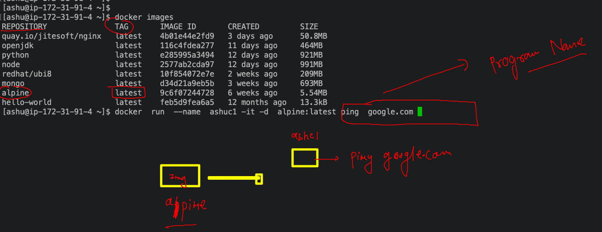

# dk-cisco-26sep2022

## Training Plan


### bare-metal systems if there is incompatiblity in apps 


### Solution by Hypervisor -- Virtualization 


### problems with Vm 


### Understanding components of OS 


### Introduction to containers 


### vm vs containers 


### FInal journey to the containers 


### Docker installation link

[click_here](https://docs.docker.com/engine/install/)

### installing docker on amazon linux 

```
[root@ip-172-31-91-4 ~]# yum  install docker -y 
Failed to set locale, defaulting to C
Loaded plugins: extras_suggestions, langpacks, priorities, update-motd
amzn2-core                                                                                                          | 3.7 kB  00:00:00     
Package docker-20.10.17-1.amzn2.x86_64 already installed and latest version
Nothing to do
[root@ip-172-31-91-4 ~]# 
[root@ip-172-31-91-4 ~]# systemctl start docker 
[root@ip-172-31-91-4 ~]# systemctl status  docker 
● docker.service - Docker Application Container Engine
   Loaded: loaded (/usr/lib/systemd/system/docker.service; enabled; vendor preset: disabled)
   Active: active (running) since Mon 2022-09-26 03:59:29 UTC; 1h 13min ago
     Docs: https://docs.docker.com
  Process: 3221 ExecStartPre=/usr/libexec/docker/docker-setup-runtimes.sh (code=exited, status=0/SUCCESS)
  Process: 3216 ExecStartPre=/bin/mkdir -p /run/docker (code=exited, status=0/SUCCESS)
 Main PID: 3231 (dockerd)
    Tasks: 8

```

### accessing and check docker installation 

```
root@ip-172-31-91-4 ~]# docker  version 
Client:
 Version:           20.10.17
 API version:       1.41
 Go version:        go1.18.3
 Git commit:        100c701
 Built:             Thu Jun 16 20:08:47 2022
 OS/Arch:           linux/amd64
 Context:           default
 Experimental:      true

Server:
 Engine:
  Version:          20.10.17
  API version:      1.41 (minimum version 1.12)
  Go version:       go1.18.3
  Git commit:       a89b842
  Built:            Thu Jun 16 20:09:24 2022
  OS/Arch:          linux/amd64
  Experimental:     false
 containerd:
  Version:          1.6.6
  GitCommit:        10c12954828e7c7c9b6e0ea9b0c02b01407d3ae1
 runc:
  Version:          1.1.3
  GitCommit:        1e7bb5b773162b57333d57f612fd72e3f8612d94
 docker-init:
  Version:          0.19.0
  GitCommit:        de40ad0

```

### to creating containers will need container app images 


### container images from container registries 


###  images & containers 


### checking and pull images in docker host 

```
[root@ip-172-31-91-4 ~]# docker  images
REPOSITORY    TAG       IMAGE ID       CREATED         SIZE
hello-world   latest    feb5d9fea6a5   12 months ago   13.3kB
[root@ip-172-31-91-4 ~]# 
[root@ip-172-31-91-4 ~]# docker  pull  python 
Using default tag: latest
latest: Pulling from library/python
23858da423a6: Pull complete 
326f452ade5c: Pull complete 
a42821cd14fb: Pull complete 
8471b75885ef: Pull complete 
8ffa7aaef404: Pull complete 
15132af73342: Pull complete 
aaf3b07565c2: Pull complete 
736f7bc16867: Pull complete 
94da21e53a5b: Pull complete 
Digest: sha256:e9c35537103a2801a30b15a77d4a56b35532c964489b125ec1ff24f3d5b53409
Status: Downloaded newer image for python:latest
docker.io/library/python:latest
[root@ip-172-31-91-4 ~]# docker images
REPOSITORY    TAG       IMAGE ID       CREATED         SIZE
python        latest    e285995a3494   12 days ago     921MB
hello-world   latest    feb5d9fea6a5   12 months ago   13.3kB
```

###

```
[root@ip-172-31-91-4 ~]# docker pull openjdk 
Using default tag: latest
latest: Pulling from library/openjdk
051f419db9dd: Pull complete 
aa51c6010a14: Pull complete 
eb80f8e66e0b: Pull complete 
Digest: sha256:14a8f0b5f29cf814e635c03a20be91bc498b8f52e7ea59ee1fa59189439e8c26
Status: Downloaded newer image for openjdk:latest
docker.io/library/openjdk:latest
[root@ip-172-31-91-4 ~]# docker pull redhat/ubi8
Using default tag: latest
latest: Pulling from redhat/ubi8
1b3417e31a5e: Pull complete 
809fe483e885: Pull complete 
Digest: sha256:8ce9caf9d86c83b47bda7c73a8fafb5fcf17f56ea13c050408cfb59aae28ae98
Status: Downloaded newer image for redhat/ubi8:latest
docker.io/redhat/ubi8:latest
[root@ip-172-31-91-4 ~]# docker images
REPOSITORY    TAG       IMAGE ID       CREATED         SIZE
openjdk       latest    116c4fdea277   11 days ago     464MB
python        latest    e285995a3494   12 days ago     921MB
node          latest    2577ab2cda97   12 days ago     991MB
redhat/ubi8   latest    10f854072e7e   2 weeks ago     209MB
hello-world   latest    feb5d9fea6a5   12 months ago   13.3kB
```

### container with single process 


## creating container 



### 

```
[ashu@ip-172-31-91-4 ~]$ docker  run  --name  ashuc1 -it -d  alpine:latest ping  google.com 
1f65441968408d909e4c0e40fda5195eb03753f441d3ab1cd33e461dd2cbfc01
[ashu@ip-172-31-91-4 ~]$ docker  ps
CONTAINER ID   IMAGE           COMMAND             CREATED          STATUS          PORTS     NAMES
b58a23c12d6f   alpine:latest   "ping google.com"   3 seconds ago    Up 1 second               sridhar1
1f6544196840   alpine:latest   "ping google.com"   6 seconds ago    Up 4 seconds              ashuc1
4a8bd89328fc   alpine:latest   "ping google.com"   54 seconds ago   Up 53 seconds             suhas
[ashu@ip-172-31-91-4 ~]$ 

```


